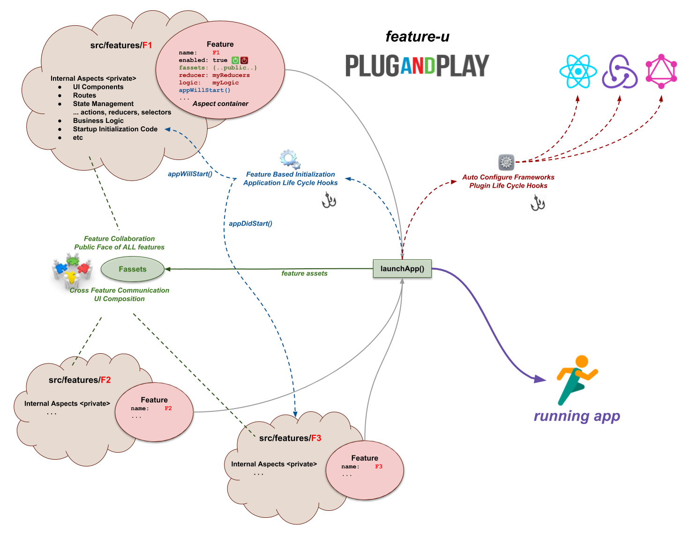

# feature-u

**feature-u** is a utility library that _facilitates feature-based
project organization_ in your [`react`] project.  It assists
in organizing your project by individual features.

Most software engineers would agree that organizing your project by
feature is much preferred over type-based patterns.  As
application domains grow in the real world, project organization by
type simply doesn't scale, it just becomes unmanageable!  There are a
number of good articles that discuss this topic _(with insights on
feature-based design and structure)_.

**feature-u** is a utility library that manages and streamlines this
process.  It automates some of the mundane details of managing
features and helps in promoting features that are **plug-and-play**.

You can quickly **"come up to speed"** with **feature-u** by reviewing
the [`Playful Features Video`], that builds concepts,
and demonstrates them in a real world app ([`eatery-nod-w`]).

**feature-u** allows you to **focus your attention on the "business
end" of your features!**

<!--- Badges for CI Builds ---> 
[](https://travis-ci.org/KevinAst/feature-u)
[](https://www.codacy.com/app/KevinAst/feature-u?utm_source=github.com&amp;utm_medium=referral&amp;utm_content=KevinAst/feature-u&amp;utm_campaign=Badge_Grade)
[](https://www.codacy.com/app/KevinAst/feature-u?utm_source=github.com&utm_medium=referral&utm_content=KevinAst/feature-u&utm_campaign=Badge_Coverage)
[](https://snyk.io/test/github/kevinast/feature-u?targetFile=package.json)
[](https://www.npmjs.com/package/feature-u)


## Install

- **peerDependencies**:

  **feature-u** has a peerDependency on react _(most likely you should
  already have this installed ... but just in case)_:

  ```shell
  npm install --save react
  ```
  <!--- WITH REVEAL of USAGE:
  npm install --save react   # VER: >=0.14.0   USAGE: React Context and JSX (in withFassets.js and launchApp.js)
  ---> 

- **the main event**:

  ```shell
  npm install --save feature-u
  ```

## feature-u Basics

The basic process of **feature-u** is that each feature promotes a
[`Feature`] object that contains various aspects of that
feature ... _things like: the feature's name, it's Public Interface,
whether it is enabled, initialization constructs, and resources used
to configure it's slice of the frameworks in use._

In turn, these [`Feature`] objects are supplied to [`launchApp()`],
which configures and starts your application, returning a [`Fassets`] object
(_which promotes the Public Face of each feature_).



In **feature-u**, "aspect" is a generalized term used to refer to the
various ingredients that (when combined) constitute your application.
Aspects can take on many different forms: **UI Components** &bull; **Routes**
&bull; **State Management** _(actions, reducers, selectors)_ &bull;
**Business Logic** &bull; **Startup Initialization Code** &bull;
_etc. etc. etc._

**Not all aspects are of interest to feature-u** ...  _only those that
are needed to setup and launch the app_ ... all others are considered
an internal implementation detail of the feature.  As an example,
consider the redux state manager: while it uses actions, reducers, and
selectors ... only reducers are needed to setup and configure redux.

A fundamental goal of **feature-u** is to **automatically configure
the framework(s)** used in your run-time-stack _(by accumulating the
necessary resources across all your features)_.  Because not everyone
uses the same frameworks, **feature-u** accomplishes this through
**Extendable Aspects** _(you can find them in external NPM packages,
or you can create your own)_.  The interface to your chosen frameworks
is not altered in any way.  You use them the same way you always have
_(just within your feature boundary)_.

## Usage

The basic usage pattern of **feature-u** is to:

1. Organize your app into features.

   * Each feature should be located in it's own directory, typically
     within a `features/` parent directory.

   * How you break your app up into features will take some time and
     thought.  There are many ways to approach this from a design
     perspective.

   * Each feature will promote it's characteristics through a
     [`Feature`] object (using [`createFeature()`]).

   * A `features/index.js` module will accumulate and promote all of
     the [`Features`] that make up your entire application.

1. Choose the [`Aspects`] that you will need, based on your
   selected frameworks (i.e. your run-time stack).

   * Typically these [`Aspects`] are packaged separately in
     NPM, although you can create your own (if needed).

   * Each [`Aspect`] will extend the properties accepted by the
     Feature object (for example: `Feature.reducer` for [`redux`], or
     `Feature.logic` for [`redux-logic`]).

   * A best practice is to organize an `aspects/` directory, mimicking
     the same pattern as your `features/` directory.

   * An `aspects/index.js` module will accumulate and promote all of
     the aspects used by your application.

1. Your mainline will start the app by invoking [`launchApp()`], passing
   all [`Features`] and [`Aspects`].

**Easy Peasy!!**


## Directory Structure

Here is a sample directory structure of an app that uses **feature-u**:

```
src/
  app.js              ... launches app using launchApp()

  aspects/
    index.js          ... accumulate/promote all Aspect objects (used by the app)

                      ... NOTE: the aspects/ dir can contain local Aspects, however
                                because most Aspects are pulled from external 
                                NPM packages, this directory is typically empty!

  features/
    index.js          ... accumulate/promote all Feature objects (for the entire app)

    featureA/         ... a feature (within the app)
      actions.js
      appDidStart.js
      appWillStart.js
      comp/
        ScreenA1.js
        ScreenA2.js
      feature.js      ... promotes featureA object using createFeature()
      index.js        ... redirect parent dir import to the feature object
      logic.js
      reducer.js
      route.js

    featureB/         ... another feature
      ...

  util/               ... common utilities used across all features
    ...
```

Each feature is located in it's own directory, containing it's aspects
(actions, reducers, components, routes, logic, etc.).


## Feature Object

Each feature promotes it's aspect content through a
[`Feature`] object (using [`createFeature()`]).

**`src/feature/featureA/index.js`**
```js
import {createFeature}  from 'feature-u';
import reducer          from './state';
import logic            from './logic';
import route            from './route';
import appWillStart     from './appWillStart';
import appDidStart      from './appDidStart';

export default createFeature({
  name:     'featureA',
  enabled:  true,

  fassets: {
    define: {
      'api.openA':  () => ... implementation omitted,
      'api.closeA': () => ... implementation omitted,
    },
  },

  reducer,
  logic,
  route,

  appWillStart,
  appDidStart,
});
```

The docs will fill in more detail, but for now notice that the feature
is conveying reducers, logic modules, routes, and does some type of
initialization (appWillStart/appDidStart).  It also promotes something
called `fassets` (feature assets - the Public Face of a feature) with
`openA()` and `closeA()` functions which will be publicly promoted to
other features.

**Note**: Feature directory imports are redirected to the feature
object reference ... for example:

**src/features/featureA/index.js**
```js
// redirect parent dir import to the feature reference
export {default} from './feature';
```

<!--- START COMMENT: Feature/Aspect Accumulation is too much for README

## Feature Accumulation

All [`Features`] are accumulated in a single `index.js`
module, allowing them to be promoted through a single import.

**src/features/index.js**
```js
import featureA  from './featureA';
import featureB  from './featureB';

// promote ALL app features through a single import (accumulated in an array)
export default [
  featureA,
  featureB,
];
```

**Note**: While this represents a complete list of all app features,
some of them may be disabled (i.e. logically removed) ... see:
[`Feature Enablement`].


## Aspect Accumulation

A best practice is to accumulate all [`Aspects`] in a single
`aspects/index.js` module, allowing them to be promoted through a
single import.

**src/aspects/index.js**
```js
import React                  from 'react';
import {createReducerAspect}  from 'feature-redux';
import {createLogicAspect}    from 'feature-redux-logic';
import {createRouteAspect}    from 'feature-router';
import SplashScreen           from 'util/SplashScreen';

// define/configure the aspects representing the app's run-time stack
// ... redux - extending: Feature.reducer
const reducerAspect = createReducerAspect();
// ... redux-logic - extending: Feature.logic
const logicAspect   = createLogicAspect();
// ... Feature Routes - extending: Feature.route
const routeAspect   = createRouteAspect();
// ... CONFIG: define fallback screen (used when no routes are in effect)
routeAspect.config.fallbackElm$ = <SplashScreen msg="I'm trying to think but it hurts!"/>;

// promote the aspects representing the app's run-time stack
export default [
  reducerAspect,
  logicAspect,
  routeAspect,
];
```

These [`Aspects`] _(pulled from external npm packages)_
reflect the frameworks of the app's run-time stack _(in this example
[`redux`], [`redux-logic`], and
[`feature-router`])_ and extend the acceptable Feature
properties _(`Feature.reducer`, `Feature.logic`, and `Feature.route`
respectively)_ ... _**see:** [`Extendable aspects`]_

**Note**: The main difference in this module (vs. `features/index.js`)
is that it is typically pulling/configuring resources from external
NPM packages, rather than locally defined within the project
_(although you can create your own if needed)_.

END COMMENT ---> 

## launchApp()

In **feature-u** the application mainline is very simple and generic.
There is no real app-specific code in it ... **not even any global
initialization**!  That is because **each feature can inject their own
app-specific constructs**!!  The mainline merely accumulates the
[`Features`] and [`Aspects`], and starts the app by
invoking [`launchApp()`]:

**src/app.js**
```js
import ReactDOM     from 'react-dom';
import {launchApp}  from 'feature-u';
import features     from 'features';
import aspects      from 'aspects';

// launch our app, exposing the Fassets object (facilitating cross-feature-communication)
export default launchApp({          // *4*
                                    
  features,                         // *1*
  aspects,                          // *2*

  registerRootAppElm(rootAppElm) {  // *3*
    ReactDOM.render(rootAppElm,
                    document.getElementById('root'));
  },
});
```

Here are some **important points of interest** _(match the numbers to
`*n*` in the code above)_:

1. all app features are supplied (accumulated from the `features/`
   directory) ... _**see:** [`Feature Accumulation`]_

2. the app aspects (i.e. the run-time stack) are supplied (accumulated
   from the `aspects/` directory) ... _**see:** [`Aspect Accumulation`]_

3. a [`registerRootAppElm()`] callback is used to catalog the
   supplied `rootAppElm` to the specific React platform in use.
   Because this registration is accomplished by your app-specific
   code, **feature-u** can operate in any of the React platforms, such
   as: React Web, React Native, Expo, etc. ... _**see:**
   [`React Registration`]_

4. _as a bit of a preview_, the return value of [`launchApp()`] is a
   [`Fassets`] object, which promotes the accumulated Public Face of
   all features, and is exported to provide [`Cross Feature
   Communication`] ... _here is what the `fassets` looks like (for
   this example):_

   ```js
   fassets: {
     api: {
       openA(),
       closeA(),
     },
   }
   ```

Hopefully this gives you a basic feel of how **feature-u** operates.


## Comprehensive Documentation

The sample above just scratches the service!

**Comprehensive Documentation** can be found at https://feature-u.js.org/,
which includes both a **Dev Guide** *(building concepts with full and
thorough **examples**)*, and a complete **API Reference**.


## Benefits

The benefits of using **feature-u** include:

1. **Feature Encapsulation:**
   _isolating feature boundaries improves code manageability_

1. **Feature Collaboration:**
   _promote **Cross Feature Communication** through a well-defined
   feature-based Public Interface_

1. **Feature Based UI Composition:**
   _facilitate seamless **cross-feature component composition**_

1. **Application Life Cycle Hooks:**
   _features can initialize themselves without relying on an external
   process_

1. **Feature Enablement:**
    _enable/disable features through a run-time switch_

1. **Minimize Feature Order Dependency Issues**
   _during in-line code expansion_

1. **Framework Integration:**
   _automatically configure used framework(s) (matching the app's
   run-time-stack) by accumulating all feature aspects (employing an
   extendable API)_

1. **UI Component Promotion:**
   _features can autonomously promote their UI components through
   Feature Based Route Management_

1. **Single Source of Truth:**
   _is facilitated in a number of ways within a feature's
   implementation_

1. **Simplified App Startup:**
   _launching an app can be accomplished through a single line of
   executable code!_

1. **Operates in any React Platform**
   _React Web, React Native, Expo, etc._

1. **Plug-and-Play:**
   _features can be more easily added or removed_


## Real Example

Want to see a real **feature-u** app?

[`eatery-nod-w`] is the application _where **feature-u** was
conceived_.  It is a [`react-native`] [`expo`] mobile
app, and is one of my sandbox applications that I use to test
frameworks.  _I like to develop apps that I can use, but have enough
real-world requirements to make it interesting._

**[`eatery-nod-w`]** randomly selects a "date night" restaurant
from a pool of favorites.  _My wife and I have a steady "date night",
and we are always indecisive on which of our favorite restaurants to
frequent :-)_ So **[`eatery-nod-w`]** provides the spinning
wheel!


## Video Presentation

When grasping a new concept, it is helpful to **see it in action!**

You can quickly **"come up to speed"** with **feature-u** by reviewing
the [`Playful Features Video`].

This is a **screencast video** of a presentation that has been given
to a number of regional conferences and local meetup groups.  It
closely follows the [`Basic Concepts`] section, and demonstrates the
newly developed concepts in a real world app ([`eatery-nod-w`]).


I hope you enjoy **feature-u**, and comments are always welcome.

&lt;/Kevin&gt;


[`Fassets`]:                      https://feature-u.js.org/cur/api.html#Fassets
[`Feature`]:                      https://feature-u.js.org/cur/api.html#Feature
[`Features`]:                     https://feature-u.js.org/cur/api.html#Feature
[`Aspects`]:                      https://feature-u.js.org/cur/api.html#Aspect
[`createFeature()`]:              https://feature-u.js.org/cur/api.html#createFeature
[`launchApp()`]:                  https://feature-u.js.org/cur/api.html#launchApp
[`registerRootAppElm()`]:         https://feature-u.js.org/cur/api.html#registerRootAppElmCB
[`eatery-nod-w`]:                 https://github.com/KevinAst/eatery-nod-w
[`expo`]:                         https://expo.io/
[`feature-router`]:               https://github.com/KevinAst/feature-router
[`react-native`]:                 https://facebook.github.io/react-native/
[`react`]:                        https://reactjs.org/
[`redux-logic`]:                  https://github.com/jeffbski/redux-logic
[`redux`]:                        http://redux.js.org/
[`Cross Feature Communication`]:  https://feature-u.js.org/cur/crossCommunication.html
[`Extendable aspects`]:           https://feature-u.js.org/cur/detail.html#extendable-aspects
[`React Registration`]:           https://feature-u.js.org/cur/detail.html#react-registration
[`Feature Enablement`]:           https://feature-u.js.org/cur/enablement.html
[`Feature Accumulation`]:         https://feature-u.js.org/cur/usage.html#feature-accumulation
[`Aspect Accumulation`]:          https://feature-u.js.org/cur/usage.html#aspect-accumulation
[`Playful Features Video`]:       https://feature-u.js.org/cur/presentation.html
[`Basic Concepts`]:               https://feature-u.js.org/cur/concepts.html
