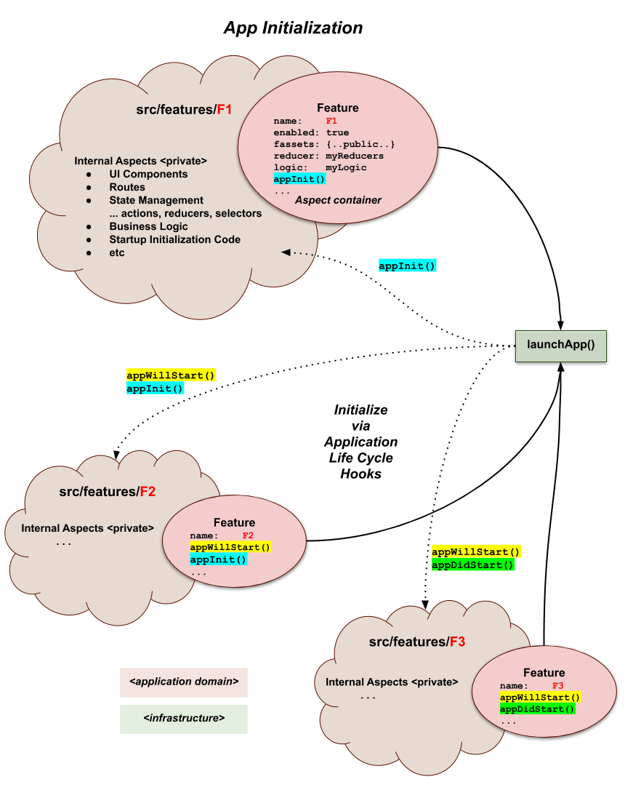

# Application Life Cycle Hooks

Because **feature-u** is in control of launching your application, it
has a unique opportunity to introduce **Application Life Cycle
Hooks**.  These hooks allow your **features to initialize themselves**,
performing app-specific initialization and even inject static content
in the root of your DOM.

Three hooks are provided through the following built-in
{{book.api.Feature}} aspects:

1. [`Feature.appWillStart`](#appwillstart) - invoked early in app startup _(supports accumulative static root DOM injection)_
2. [`Feature.appInit`](#appinit)           - invoked later in app startup _(supports blocking async initialization)_
3. [`Feature.appDidStart`](#appdidstart)   - invoked when app startup completes _(triggers "app is running" processes)_

<p align="center"></p>

Application Life Cycle Hooks **greatly simplify your app's mainline
startup process**, because _initialization specific to a given feature
**can be encapsulated in that feature**_.


## appWillStart

The Feature {{book.api.appWillStartCB}} life-cycle hook is invoked one
time, very early in the app startup process.  It supports both general
app-specific initialization, as well as accumulative static root DOM
injection.

**API**: {{book.api.appWillStartCB$}}

Here you may perform any type of general initialization that is
required by your feature.  The following example initializes a **PWA
service worker**:

```js
appWillStart({fassets, curRootAppElm}) {
  serviceWorker.register();
}
```

### Injecting DOM Content

In addition, the {{book.api.appWillStartCB}} life-cycle hook can
optionally inject static content in the app's DOM root.  Any return is
interpreted as the app's new `rootAppElm` _(an accumulative process
... see below)_.

Here is an example that injects new root-level content:

```js
appWillStart({fassets, curRootAppElm}) {
  ... other app-specific initialization here ...
  return (
    <Drawer ...>
      {curRootAppElm}
    </Drawer>
  );
}
```

Here is an example of injecting a new sibling to `curRootAppElm` _(using
React Fragments)_:

```js
appWillStart: ({fassets, curRootAppElm}) => (
  <>
    <Notify/>
    {curRootAppElm}
  </>
)
```

**IMPORTANT**: 
---

You may have noticed _(in the examples above)_ that injecting DOM
content _(via the function return)_ is an accumulative process.  Any new
`rootAppElm` returned from this hook **must include** the supplied
`curRootAppElm` parameter.

The `curRootAppElm` parameter (when non-null) represents content from
other features (within your app) or aspects (used by your app).
As a result, by including it in your injection, it accommodates the
accumulative process of other feature/aspect injections!

This is outside the control of **feature-u**, and if you neglect to do
it, you will be silently dropping content on the floor ... wondering
why some feature/aspect is NOT working.

**This constraint even extends to cases where the content you are
injecting doesn't support children**.  In this case you need to throw
an error, and emit applicable context in a log.
Here is an example:

```js
appWillStart({fassets, curRootAppElm}) {
  // MyContent does NOT support children
  // ... insure we don't clobber any supplied content
  if (curRootAppElm) {
    const msg = "***ERROR*** <MyContent> does NOT support children " +
                "but another feature/aspect is attempting to inject it's content. " +
                "Please resolve either by adjusting the feature expansion order, " +
                "or promoting <MyContent> through the conflicting artifact.";
    console.log(`${msg} ... conflicting artifact:`, curRootAppElm);
    throw new Error(msg);
  }
  return <MyContent .../>;
}
```

- In many cases _(such as a feature conflict)_, this can be resolved
  by adjusting the feature expansion order.

- In other cases, it may seem as though you have hit an impasse.  For
  example, if your content doesn't support children, and an aspect
  you are using doesn't support children.  Normally this doesn't mean
  that you can't use your component, it merely means that you must
  promote your component in a different way ... most likely through
  the Aspect in conflict.

Because this check is rather tedious, **feature-u** provides a
convenient {{book.api.assertNoRootAppElm}} function that performs this
check on your behalf.  The following code snippet is equivalent:

```js
appWillStart({fassets, curRootAppElm}) {
  assertNoRootAppElm(curRootAppElm, '<MyContent>'); // insure no content is clobbered (children NOT supported)
  return <MyContent .../>;
}
```


## appInit

The Feature {{book.api.appInitCB}} life-cycle hook is invoked one time,
later in the app startup process.  It supports blocking async
initialization.

**API**: {{book.api.appInitCB$}}

This hook is invoked when the app is **nearly up-and-running**.

- The {{book.guide.detail_reactRegistration}} has already occurred
  _(via the {{book.api.registerRootAppElmCB}} callback)_.  As a
  result, you can rely on utilities that require an app-specific
  `rootAppElm` to exist.

- You have access to the `getState()` and `dispatch()` functions,
  assuming you are using {{book.ext.redux}} (when detected by
  **feature-u**'s plugable aspects).  

  These parameters are actually injected by the
  {{book.ext.featureRedux}} Aspect, and are examples of what can be
  injected by any Aspect _(please refer your specific Aspect's
  documentation to determine other parameters)_.

Just like the [`appWillStart`](#appwillstart) hook, you may perform
any type of general initialization that is required by your feature.

However the **hallmark of this hook** is **you can block for any
asynchronous initialization to complete**.  By simply returning a
promise, **feature-u** will wait for the process to complete.

The user is kept advised of any long-running async processes.  By
default an `'initializing feature: {feature.name}'` message is used,
but you can customize it through the supplied
{{book.api.showStatusCB}} function parameter.

The following example shows three processes managed by `appInit()`
_(one synchronous, and two asynchronous)_:

```js
async appInit({showStatus, fassets, getState, dispatch}) {

  // default view is our TODO List
  showStatus('Defaulting view to TODO List);
  dispatch( fassets.actions.changeView('ToDoList') );

  // initialize our DB Connection
  showStatus('Initializing our DB Connection);
  await initDB();

  // maintain the current GPS device location in our appState
  showStatus('Initializing GPS Location');
  const location = await getCurPos();
  dispatch( setLocation(location) );
},
```


## appDidStart

The Feature {{book.api.appDidStartCB}} life-cycle hook is invoked one
time, once the app startup process has completed.  It can be used to
trigger **"the app is running"** events.

**API**: {{book.api.appDidStartCB$}}

Because the app is **up-and-running** at this time, you have access to
the `getState()` and `dispatch()` functions, assuming you are using
{{book.ext.redux}} (when detected by **feature-u**'s plugable
aspects).  These parameters are actually injected by the
{{book.ext.featureRedux}} Aspect, and are examples of what can be
injected by any Aspect _(please refer your specific Aspect's
documentation to determine other parameters)_.

A typical usage for this hook is to **"kick start"** some early
application logic.  The following example starts the process of
authenticating the user ... either an automatic signin (with saved
credentials), or a manual signin (managing the signin screens):

```js
appDidStart({fassets, getState, dispatch}) {
  dispatch( actions.authSignIn() );
}
```
