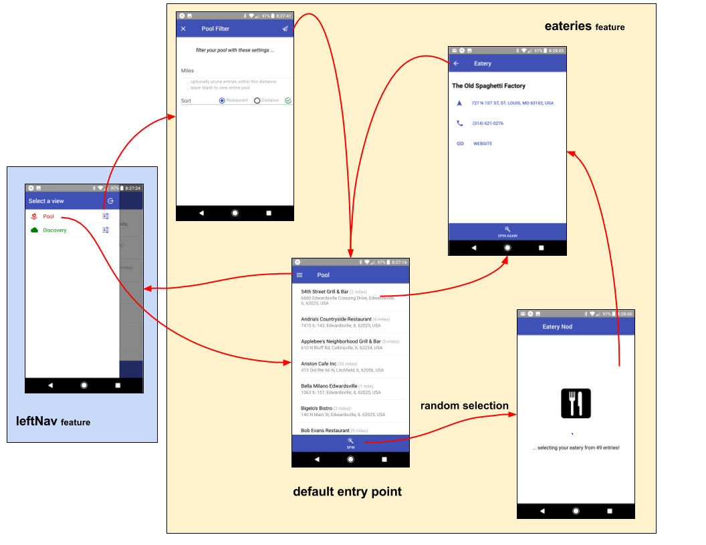

# feature-u (Feature-Based Development for React)

This article is an introduction to **[feature-u]** - a library that
_facilitates feature-based development_ in your [react]
project.  This utility assists in organizing your project by
individual features.

<p align="center"></p>

Most developers would agree that organizing your project by features is
much preferred over type-based patterns.  Because **application
domains grow** _in the real world_, project **organization by type
simply doesn't scale**, _it just becomes unmanageable_!  There are
many good articles on this topic with insights on feature-based design
and structure _(see: [References] below TK:medium-resolve-internal-link)_.

This article outlines my excursion into feature-based composition.  In
working through the details, I realized there was an opportunity for a
library to help manage and streamline some of the hurdles incurred in
this process.  The result: **feature-u** _(check out the [full
docs], [github source], and [npm package])_.

---

**Update**: On 8/14/2018 [feature-u V1] was released, that re-designed
[Cross Feature Communication `new`] to include [UI Composition `new`]
as a core offering.  **A new article can be found
[here](http://bit.ly/feature-u-V1)** that takes a comprehensive
approach in introducing you to all of **feature-u** (including
**V1**).  We are very excited about this update, because it **promotes
one solution for all feature collaboration**!  While upgrading to V1
requires some client code mods (see [V1 Migration Notes]), it is well
worth it.  This article is based on [feature-u V0], and is using some
antiquated APIs (mostly `Feature.publicFace`, and the `app` object).
Still, this is a good resource to get your feet wet with feature-u.

[feature-u V1]:                       https://feature-u.js.org/1.0.0/history.html#v1_0_0
[feature-u V0]:                       https://feature-u.js.org/0.1.3/history.html#v0_1_3
[V1 Migration Notes]:                 https://feature-u.js.org/1.0.0/migration.1.0.0.html
[Cross Feature Communication `new`]:  https://feature-u.js.org/1.0.0/crossCommunication.html
[UI Composition `new`]:               https://feature-u.js.org/1.0.0/crossCommunication.html#ui-composition


## At a Glance

TK:medium-resolve-internal-links

- [Backdrop] ... _why was **feature-u** was created_
- [feature-u Basics] ... _introduce high-level **feature-u** concepts_
- [eatery-nod App] ... _the sample app used to demonstrate **feature-u**_
- [Before & After] ... _**eatery-nod** project structure **before** and **after** features_
- [feature-u In Action] ... _explore **feature-u** aspects through concrete examples_
- [feature-u Benefits] ... _in summary_
- [References] ... _feature-based articles_


<!-- *** SECTION ********************************************************************************  -->
## Backdrop

Let's start by chronicling my journey in this process

**out of the Starting Gate ...**

<ul><!--- indentation hack for github - other attempts with style is stripped (be careful with number bullets) ---> 

_sooo ...  I had decided to restructure my project by features_.  From
a design perspective, there were a number of considerations in
determining the feature boundaries.  I had read all the articles, and
applied my design to a **new feature-based directory structure**.

In general, I was feeling good about my progress.  I was starting to
see concrete benefits ... **feature segregation was going to result in
code that is much more manageable!**

</ul>

**the Hurdles ...**

<ul><!--- indentation hack for github - other attempts with style is stripped (be careful with number bullets) ---> 

However, there were a number of hurdles yet to be resolved ...

- How can I encapsulate and isolate my features, while still
  allowing them to collaborate with one another?

- How can selected features introduce start-up initialization (_even
  injecting utility at the root DOM_), without relying on some external
  startup process?

- How can I promote feature-based UI components in an isolated and
  autonomous way?

- How can I configure my chosen frameworks now that my code is so
  spread out?

- How can I enable/disable selected features which are either
  optional, or require a license upgrade?

- In short, how can I pull it all together so that my individual
  features operate as one application?

</ul>

**the Goal _(what now?)_ ...**

<ul><!--- indentation hack for github - other attempts with style is stripped (be careful with number bullets) ---> 

The **overriding goal** of **feature-u** is two fold:

1. Allow features to **Plug-and-Play!** This encompasses many things,
   such as: encapsulation, cross communication, enablement,
   initialization, etc., etc.  We will build on these concepts
   throughout this article.

2. **Automate the startup of your application!!** You have the
   features.  Allow them to promote their characteristics, so a
   central utility can **automatically configure the frameworks** used
   in your app, thereby **launching your application!** This task
   **must be accomplished in an extendable way**, _because not
   everyone uses the same set of frameworks!_

</ul>

<!-- *** SECTION ********************************************************************************  -->
## feature-u Basics

The basic process of **[feature-u]** is that each feature promotes a
[`Feature`] object that contains various aspects of that feature
... _things like: the feature's name, it's Public API, whether it is
enabled, initialization constructs, and resources used to configure
it's slice of the frameworks in use._

In turn, these [`Feature`] objects are supplied to [`launchApp()`],
which configures and starts your application running.  In addition the
returned [`App`] object is exported, _in order to promote the public
API of each feature_.

_aspects ..._

In **feature-u**, "aspect" is a generalized term used to refer to the
various ingredients that (when combined) constitute your application.
Aspects can take on many different forms: **UI Components** and
**Routes** &bull; **State Management** _(actions, reducers,
selectors)_ &bull; **Business Logic** &bull; **Startup Initialization
Code** &bull; _etc. etc. etc._

**Not all aspects are of interest to feature-u** ...  _only those that
are needed to setup and launch the app_ ... all others are considered
an internal implementation detail of the feature.  As an example,
consider the redux state manager: while it uses actions, reducers, and
selectors ... only reducers are needed to setup and configure redux.

_framework integration ..._

A fundamental goal of **[feature-u]** is to **automatically configure
the framework(s)** used in your run-time-stack _(by accumulating the
necessary resources across all your features)_.  Because not everyone
uses the same frameworks, **feature-u** accomplishes this through
**Extendable Aspects** _(you can find them in external NPM packages,
or you can create your own)_.

It is important to understand that the interface to your chosen
frameworks is not altered in any way.  You use them the same way you
always have _(just within your feature boundary)_.  **feature-u**
merely provides a well defined organizational layer, where the
frameworks are automatically setup and configured by accumulating the
necessary resources across all your features.


<!-- *** SECTION ********************************************************************************  -->
## eatery-nod App

**[eatery-nod]** is the application _where **[feature-u]** was conceived_.
It is a [react-native] - [expo] mobile app, and is one of my sandbox
applications that I use to test frameworks.  I like to develop apps
that I can use, but have enough real-world requirements to make it
interesting.

**eatery-nod** randomly selects a "date night" restaurant from a pool
of favorites.  _My wife and I have a steady "date night", and we are
always indecisive on which of our favorite restaurants to frequent
:-)_ So **eatery-nod** provides the spinning wheel!

Take a look at the **eatery-nod** [README] to get a feel for the
application.  **Screen flows are available**, _so it really helps in
your orientation to the project_.

<p align="center"></p>

In addition, [README files] are found in each feature, describing what
each feature accomplishes.  Take some time now and skim through these
resources:

- [device]:      initializes the device for use by the app, and promotes a **device api** abstraction
- [auth]:        promotes complete user authentication
- [leftNav]:     promotes the app-specific Drawer/SideBar on the app's left side
- [currentView]: maintains the currentView with get/set cross-feature communication bindings
- [eateries]:    manages and promotes the eateries view
- [discovery]:   manages and promotes the discovery view
- [firebase]:    initializes the google firebase service
- [logActions]:  logs all dispatched actions and resulting state
- [sandbox]:     promotes a variety of interactive tests, used in development, that can easily be disabled


<!-- *** SECTION ********************************************************************************  -->
## Before & After

Anyone who knows me will tell you that I have an appreciation for a
good before/after analysis.  Whether it is a home remodel or a
software refactor, it helps to chronicle where you have been, so as to
quantify concrete achievements _(giving you a sense of
accomplishment)_.

<p align="center"></p>

Let's take a look at **eatery-nod**'s directory structure
(before/after).

For illustration purposes, I have only expanded a few directories, but
I think you get the idea _(click on the caption link to navigate the
actual code - sourced on github)_.

**Before**: _here is my project before features ..._

[src BEFORE]

```
eatery-nod src BEFORE features

src/
├──actions/        ... redux actions
│     auth.js
│     discovery.js
│     eateries.js
│     ... snip snip
├──api/            ... various abstract APIs
│     device.js
│     discovery.js
│     ... snip snip
├──app/            ... mainline startup **1**
│  │  ScreenRouter.js
│  │  SideBar.js
│  │  index.js
│  └──startup/
│     │  createAppStore.js
│     │  platformSetup.android.js
│     │  platformSetup.ios.js
│     └──firebase/
│           firebaseAppConfig.js
│           initFireBase.js
├──appState/       ... redux reducers
│     auth.js
│     discovery.js
│     eateries.js
│     ... snip snip
├──comp/           ... UI Component Screens
│     DiscoveryListScreen.js
│     EateriesListScreen.js
│     ... snip snip
├──logic/          ... redux-logic modules
│     auth.js
│     discovery.js
│     eateries.js
│     ... snip snip
└──util/           ... common utilities
```


**After**: _and here is the same project after features ..._

[src AFTER]
```
eatery-nod src AFTER features

src/
│  app.js          ... launches app via launchApp() **2**
├──feature/
│  │  index.js     ... accumulate/promote all app Feature objects
│  ├──auth/        ... the app's authorization feature
│  │  │  actions.js
│  │  │  featureName.js
│  │  │  index.js
│  │  │  logic.js
│  │  │  publicFace.js
│  │  │  route.js
│  │  │  signInFormMeta.js
│  │  │  state.js
│  │  └──comp/
│  │        SignInScreen.js
│  │        SignInVerifyScreen.js
│  ├──currentView/ ... other features
│  ├──device/      ... feature to initialize the device
│  │  │  actions.js
│  │  │  api.js
│  │  │  appDidStart.js
│  │  │  appWillStart.js
│  │  │  featureName.js
│  │  │  index.js
│  │  │  logic.js
│  │  │  publicFace.js
│  │  │  route.js
│  │  │  state.js
│  │  └──init/
│  │        platformSetup.android.js
│  │        platformSetup.ios.js
│  ├──discovery/   ... more features
│  ├──eateries/
│  ├──firebase/
│  ├──leftNav/
│  ├──logActions/
│  └──sandbox/
└──util/           ... common utilities used across all features
```

As expected, **the difference in project organization is dramatic**!

- **Before features**: you find constructs for a given feature spread
  over numerous typed directories.

- **After features**: all aspects of a given feature are contained in
  it's own isolated directory.

- A notable difference is **the dramatic reduction in complexity of
  the application startup process!** The "before features" contained
  an entire `app\` directory of startup code _(see `**1**` above)_,
  while the "after features" simply contains a single `app.js` startup
  file _(see `**2**` above)_.  **Where did all the complexity go?**
  _... stay tuned_!


<!-- *** SECTION ********************************************************************************  -->
## feature-u In Action

To better understand **[feature-u]**, let's take a closer look at some
**[eatery-nod]** examples in action.

<p align="center"></p>

Each of the following sections briefly introduce a new **feature-u**
topic, correlating sample code from **eatery-nod**.  Additional
information is provided through links, both to the **feature-u** docs,
and **eatery-nod** source code.  In some cases the in-lined sample
code has been streamlined _(to emphasize a focal point)_, however the
caption link will take you to the actual code _(hosted on github)_.

Here are our topics ...

TK:medium-resolve-internal-links

0. INTERNAL: markdown shows order from "Why" section
9. [Simplified App Startup]
0. [React Platforms]
0. [Feature Object]
3. [Feature Initialization]
2. [Feature Collaboration]
6. [Framework Integration]
4. [Feature Enablement](#feature-enablement)
5. [Managed Code Expansion](#managed-code-expansion)
7. [UI Component Promotion]
8. [Single Source of Truth]


<!-- 
"Why feature-u" docs section
   ... it should be OK to re-order
   ... emphasizing a progression that makes sense

1. Feature Encapsulation <<< ABSTRACT CONCEPT NOT presented here (it is an amalgamation of several items)
2. Feature Collaboration
3. Feature Initialization
4. Feature Enablement
5. Resource Resolution during Code Expansion
6. Framework Integration
7. UI Component Promotion
8. Single Source of Truth
9. Simplified App Startup
-->


<!-- ** SUB-SECTION ********************************************************************************  -->
## Simplified App Startup

After breaking your application up into pieces _(i.e. features)_, how
do you pull them all back together, and actually start your app
running?  At first glance, this may seem like a daunting task.  As it
turns out, however, because of the structure promoted by
**feature-u**, it actually is a very simple process.

To solve this, **feature-u** provides the [`launchApp()`] function
_(see: [Launching Your Application])_.

Here is **eatery-nod**'s mainline ...

TK: For medium article, use this [GIST](https://gist.github.com/KevinAst/5639a1c9912290187ce900bb7f555328#file-app-js-L9-L22)
with caption:
**[`src/app.js`](https://github.com/KevinAst/eatery-nod/blob/after-features/src/app.js#L28-L34)** 
```js
import Expo              from 'expo';
import {launchApp}       from 'feature-u';
import {reducerAspect}   from 'feature-redux';
import {logicAspect}     from 'feature-redux-logic';
import {routeAspect}     from 'feature-router';
import features          from './feature'; // the set of features that comprise this application

// launch our app, exposing the App object (facilitating cross-feature communication)
export default launchApp({           // *3*

  aspects: [                         // *1*
    reducerAspect, // redux          ... extending: Feature.reducer
    logicAspect,   // redux-logic    ... extending: Feature.logic
    routeAspect,   // Feature Routes ... extending: Feature.route
  ],

  features,                          // *2*

  registerRootAppElm(rootAppElm) {   // *4*
    Expo.registerRootComponent(()=>rootAppElm);
  }
});
```

The first thing to note is just how simple and generic the mainline
startup process is.  There is **no real app-specific code in it
... not even any global initialization**!  That is because
**feature-u** provides various hooks that allow your features to
inject their own app-specific constructs!!

The mainline merely accumulates the Aspects and Features, and starts
the app by invoking [`launchApp()`]:

Here are some **important points of interest** _(match the numbers to
`*n*` in the code above)_:

1. the supplied Aspects _(pulled from separate npm packages)_ reflect
   the frameworks of our run-time stack _(in our example [redux],
   [redux-logic], and [feature-router])_ and extend the acceptable
   Feature properties _(`Feature.reducer`, `Feature.logic`, and
   `Feature.route` respectively)_ ... _**see:** [Extendable aspects]_

2. all app features are accumulated from our `feature/` directory

3. _as a preview_ to [Feature Collaboration]
   (TK:medium-resolve-internal-link), the exported return value of [`launchApp()`] is an
   [`App`] object, which promotes the accumulated Public API of all
   features.


<!-- *** SECTION ********************************************************************************  -->
## React Platforms

In the example above _(see `**4**`)_, you see that [`launchApp()`] uses
a [`registerRootAppElm()`] callback hook to register the supplied
`rootAppElm` to the specific React platform in use.  Because this
registration is accomplished by app-specific code, **feature-u** can
operate in any of the React platforms _(see [React Registration])_.

Here are some [`registerRootAppElm()`] variations:

TK: For medium article, use this [GIST](https://gist.github.com/KevinAst/ccc6d808cf49e54f56c1fc2792e78410)
with caption:
**[react web]** (in this case NOT eatery-nod code)
```js
import ReactDOM from 'react-dom';
...
export default launchApp({
  aspects,
  features,
  registerRootAppElm(rootAppElm) {
    ReactDOM.render(rootAppElm,
                    getElementById('myAppRoot'));
  }
});
```

TK: For medium article, use this [GIST](https://gist.github.com/KevinAst/f0b1866d2899b635a9768bb8d891f048)
with caption:
**[react-native]** (in this case NOT eatery-nod code)
```js
import {AppRegistry} from 'react-native';
...
export default launchApp({
  aspects,
  features,
  registerRootAppElm(rootAppElm) {
    AppRegistry.registerComponent('myAppKey',
                                  ()=>rootAppElm); // convert rootAppElm to a React Component
  }
});
```

TK: For medium article, use this [GIST](https://gist.github.com/KevinAst/ccca57a9f4fed835e62e469752159c11)
with caption:
**[expo]** (in this case NOT eatery-nod code)
```js
import Expo from 'expo';
...
export default launchApp({
  aspects,
  features,
  registerRootAppElm(rootAppElm) {
    Expo.registerRootComponent(()=>rootAppElm); // convert rootAppElm to a React Component
  }
});
```

<!-- *** SECTION ********************************************************************************  -->
## Feature Object

Each feature is located in it's own directory, and promotes aspect
content through a [`Feature`] object (using [`createFeature()`]).

Here is an example from **eatery-nod**'s [device] feature.

<!-- 
YES: device/index.js .......... contains just about every aspect
     many more
-->

TK: For medium article, use this [GIST](https://gist.github.com/KevinAst/84a6a0f1e0d67756168aaefdfd15f1cd)
with caption:
**[`src/feature/device/index.js`](https://github.com/KevinAst/eatery-nod/blob/after-features/src/feature/device/index.js#L52-L63)**
```js
import {createFeature}  from 'feature-u';
import name             from './featureName';
import publicFace       from './publicFace';
import reducer          from './state';
import logic            from './logic';
import route            from './route';
import appWillStart     from './appWillStart';
import appDidStart      from './appDidStart';

export default createFeature({
  name,

  publicFace,

  reducer,
  logic,
  route,

  appWillStart,
  appDidStart,
});
```

As you can see, the [`Feature`] object is merely a container that
holds aspect content of interest to **feature-u**.  The sole purpose
of the [`Feature`] object is to communicate this aspect information to
[`launchApp()`].

We will fill in more detail a bit later, but for now notice that the
feature is conveying reducers, logic modules, routes, and does some
type of initialization (appWillStart/appDidStart).  It also promotes a
publicFace that can be used by other features (i.e. the feature's
Public API).

For more information, please refer to [Feature & aspect content].


<!-- *** SECTION ********************************************************************************  -->
## Feature Initialization

Any given feature should not have to rely on an external startup
process to perform the initialization that it needs.  Rather, the
feature should be able to spawn initialization that it depends on.
This could be any number of things, such as &bull; initialize some
service API &bull; inject a utility react component at the App root
&bull; dispatch an action that kicks off a startup process &bull; etc.

To solve this, **feature-u** introduces two [Application Life Cycle
Hooks], injected through the following Feature aspects:

1. [`Feature.appWillStart({app, curRootAppElm}): rootAppElm || falsy`]
   ...  invoked one time, just before the app starts up.  This can do
   any type of initialization, including supplementing the app's
   top-level root element (i.e. react component instance).

2. [`Feature.appDidStart({app, appState, dispatch}): void`] ...
   invoked one time immediately after the app has started.  A typical
   usage for this hook is to dispatch some type of bootstrap action.

Here are some examples from **eatery-nod**:

<!-- 
NO:  device/appWillStart ... platformSetup()
YES: device/appDidStart .... dispatch( actions.bootstrap() );
NO:  device/appWillStart ... inject ROOT ELM: Notify component

YES: leftNav/appWillStart .. inject ROOT ELM: Drawer/SideBar component

NO:  eateries/appDidStart .. dispatch( app.currentView.actions.changeView(featureName) ); ... TOO CONFUSING: simply defaults the standard view to use

YES: firebase/appWillStart . initFireBase()
-->


- **FireBase Initialization**

  TK: For medium article, use this [GIST](https://gist.github.com/KevinAst/70e2c25c399bf0e5533f70729027bb31)
  with caption:
  **[`src/feature/firebase/index.js`](https://github.com/KevinAst/eatery-nod/blob/after-features/src/feature/firebase/index.js#L11-L13)**
  ```js
  import {createFeature}  from 'feature-u';
  import initFireBase     from './init/initFireBase';

  /**
   * The **'firebase'** feature initializes the google firebase service,
   * and provides a placeholder for future API abstractions.
   */
  export default createFeature({
    name: 'firebase',

    appWillStart({app, curRootAppElm}) {
      initFireBase(); // initialize FireBase
    },
  });
  ```

- **Bootstrap Action**

  TK: For medium article, use this [GIST](https://gist.github.com/KevinAst/9c97b1f9a1120e9ac838e9507494c4b3)
  with caption:
  **[`src/feature/device/appDidStart.js`](https://github.com/KevinAst/eatery-nod/blob/after-features/src/feature/device/appDidStart.js#L7-L9)**
  via **[`index.js`](https://github.com/KevinAst/eatery-nod/blob/after-features/src/feature/device/index.js#L62)**
  ```js
  import actions  from './actions';

  /**
   * An app-level life-cycle hook that dispatches our bootstrap action
   * that gets the ball rolling!
   */
  export default function appDidStart({app, appState, dispatch}) {
    dispatch( actions.bootstrap() );
  }
  ```

- **Inject DOM Root Elm**

  TK: For medium article, use this [GIST](https://gist.github.com/KevinAst/afeed94f1223af7db2a4a3092de4cb77)
  with caption:
  **[`src/feature/leftNav/appWillStart.js`](https://github.com/KevinAst/eatery-nod/blob/after-features/src/feature/leftNav/appWillStart.js#L10-L18)**
  via **[`index.js`](https://github.com/KevinAst/eatery-nod/blob/after-features/src/feature/leftNav/index.js#L24)**
  ```js
  import React            from 'react';
  import {Drawer}         from 'native-base';
  import SideBar, 
        {registerDrawer,
         closeSideBar}    from './comp/SideBar';

  /**
   * Inject our Drawer/SideBar component at the root of our app
   */
  export default function appWillStart({app, curRootAppElm}) {
    return (
      <Drawer ref={ ref => registerDrawer(ref) }
              content={<SideBar/>}
              onClose={closeSideBar}>
        {curRootAppElm}
      </Drawer>
    );
  }
  ```


<!-- *** SECTION ********************************************************************************  -->
## Feature Collaboration

Even though a feature's implementation is encapsulated, it still needs
to interact with it's surroundings.  To complicate matters, one
feature should never import resources from another feature, because it
should strive to be plug-and-play.  As a result, we need a
well-defined feature-based Public API.

To solve this, **feature-u** promotes a [Cross Feature Communication].
This is accomplished through the `Feature.publicFace` [Built-In
aspect] property.  A feature can expose whatever it deems necessary
through it's `publicFace`.  There are no real constraints on this
resource.  It is truly open.  Typically this involves promoting
selected **actions** &bull; **selectors** &bull; **APIs** &bull; etc.

The `publicFace` of all features are accumulated and exposed through
the [`App`] object (emitted from [`launchApp()`]).  It contains named feature
nodes, as follows:

```js
App.{featureName}.{publicFace}
```

Here is an example from **eatery-nod**'s [auth] feature.

<!-- 
NO:  device/publicFace.js ........ API     ACTIONS: ready()                                                                      SELECTORS: areFontsLoaded(appState) ... isDeviceReady(appState) ... getDeviceLoc(appState)
YES: auth/publicFace.js ..........         ACTIONS: userProfileChanged(userProfile) ... signOut()                                SELECTORS: getUserPool(appState)
NO:  leftNav/publicFace.js ....... open() close() SideBar
NO:  currentView/publicFace.js ...         ACTIONS: changeView(viewName)                                                         SELECTORS: getView(appState): string
NO:  eateries/publicFace.js ......         ACTIONS: openFilterDialog([domain] [,formMsg]) ... add(eateryId) ... remove(eateryId) SELECTORS: getDbPool(appState)
NO:  discovery/publicFace.js ..... API     ACTIONS: openFilterDialog([domain] [,formMsg])
-->


TK: For medium article, use this [GIST](https://gist.github.com/KevinAst/1584e625f7d560e2be34761f15f47406)
with caption:
**[`src/feature/auth/publicFace.js`](https://github.com/KevinAst/eatery-nod/blob/after-features/src/feature/auth/publicFace.js#L7-L15)**
via **[`index.js`](https://github.com/KevinAst/eatery-nod/blob/after-features/src/feature/auth/index.js#L49)**
```js
import actions  from './actions';
import * as sel from './state';

/**
 * The publicFace promoted by this feature through: app.auth...
 */
export default {
  actions: {
    userProfileChanged: actions.userProfileChanged, // userProfileChanged(userProfile)
    signOut:            actions.signOut,            // signOut()
  },
  sel: {
    getUserPool:        sel.getUserPool,
  },
};
```

Out of all the items found in the `auth` feature, only two actions and
one selector are public.  Here is what the [`App`] object would look
like for this example:

```js
app: {
  auth: {
    actions: {
      userProfileChanged(userProfile),
      signOut(),
    },
    sel: {
      getUserPool(appState),
    },
  },
  currentView: {   // other features
    ... snip snip
  },
}
```

As a result, the `auth` feature's public API can be accessed as
follows:

```js
  app.auth.actions.userProfileChanged(userProfile)
  app.auth.actions.signOut()
  app.auth.sel.getUserPool(appState)
```


<!-- *** SECTION ********************************************************************************  -->
## Framework Integration

Most likely your application employs one or more frameworks (ex:
[redux], [redux-logic], etc.).  How are the resources needed by these
frameworks accumulated and configured across the many features of your
app?

To solve this, **feature-u** introduces [Extendable aspects].
**feature-u** is [extendable]!!  It provides integration points
between your features and your chosen frameworks.

Extendable Aspects are packaged separately from **feature-u**, so as
to not introduce unwanted dependencies (_because not everyone uses the
same frameworks_).  You pick and choose them based on the framework(s)
used in your project _(matching your project's run-time stack)_.  They
are created with **feature-u**'s extendable API, using
[`createAspect()`].  You can define your own Aspect, _if the one you
need doesn't already exist_!

Let's take a look at a [redux] example from **eatery-nod**.  

The `device` feature maintains it's own slice of the state tree.  It
promotes it's reducer through the `Feature.reducer` aspect:

<!-- 
YES: device/state.js .... simplest state
NO:  many others
-->

TK: For medium article, use this [GIST](https://gist.github.com/KevinAst/8153d8665918d819b21308679f8f0740)
with caption:
**[`src/feature/device/index.js`](https://github.com/KevinAst/eatery-nod/blob/after-features/src/feature/device/index.js#L57)**
```js
import {createFeature}  from 'feature-u';
import name             from './featureName';
import reducer          from './state';

export default createFeature({
  name,
  reducer,
  ... snip snip
});
```

Because `Feature.reducer` is an **extended aspect** (verses a
_built-in aspect_), it is only available because we registered the
[feature-redux] `reducerAspect` to [`launchApp()`] _(please refer to
[Simplified App Startup] above TK:medium-resolve-internal-link)_

The **key thing to understand** is that **feature-u** _(through the
[feature-redux] extension)_ will automatically configure [redux] by
accumulating all feature reducers into one overall appState.

Here is the reducer code ...

TK: For medium article, use this [GIST](https://gist.github.com/KevinAst/a71e46370e0ca10621705da9628a2bb9)
with caption:
**[`src/feature/device/state.js`](https://github.com/KevinAst/eatery-nod/blob/after-features/src/feature/device/state.js#L11-L28)**
```js
import {combineReducers}  from 'redux';
import {reducerHash}      from 'astx-redux-util';
import {slicedReducer}    from 'feature-redux';
import actions            from './actions';

const reducer = slicedReducer('device', combineReducers({

  status: reducerHash({ // string: 'Waiting for bla bla bla' -or- 'READY'
    [actions.statusUpdate]: (state, action) => action.statusMsg,
  }, 'Waiting for App to start'), // initialState

  fontsLoaded: reducerHash({
    [actions.loadFonts.complete]: (state, action) => true,
    [actions.loadFonts.fail]:     (state, action) => 'Device fonts could NOT be loaded :-('
  }, false), // initialState

  loc: reducerHash({ // loc: {lat, lng}
    [actions.locateDevice.complete]: (state, action) => action.loc,
  }, null), // initialState

}) );

export default reducer;
```

A feature-based reducer is simply a normal reducer that manages the
feature's slice of the the overall appState. The only difference is it
must be embellished with [`slicedReducer()`], which provides
instructions on where to insert it in the overall top-level appState.

As a result, the `device` reducer only maintains the state relevant to
the `device` feature _(i.e. it's little slice of the world)_ ... a
**status**, a **fontsLoaded** indicator, and the **device location**.

**SideBar**: We are using the [astx-redux-util] utility's
[`reducerHash()`] function to concisely implement the feature's
reducer _(providing an alternative to the common switch statement)_.
I have found that in using a utility like this, for most cases it is
feasible to implement all the reducers of a feature in one file _(due
in part to the smaller boundary of a feature)_.  [astx-redux-util]
also promotes other [Higher-Order Reducers].  You may want to check
this out.


<!-- *** SECTION ********************************************************************************  -->
## Feature Enablement

Some of your features may need to be dynamically enabled or disabled.
As an example, certain features may only be enabled with a license
upgrade, or other features may only be used for diagnostic purposes.

To solve this, **feature-u** introduces [Feature Enablement].  Using
the `Feature.enabled` [Built-In aspect] _(a boolean property)_, you
can enable or disable your feature.

Here is an example from **eatery-nod**'s [sandbox] feature ...

<!-- 
YES: sandbox/index.js
NO:  logActions/index.js
-->

TK: For medium article, use this [GIST](https://gist.github.com/KevinAst/b1a72f3a6ab4cc4223c92781ed6ed106)
with caption:
**[`src/feature/sandbox/index.js`](https://github.com/KevinAst/eatery-nod/blob/after-features/src/feature/sandbox/index.js#L15)**
```js
import {createFeature}  from 'feature-u';

export default createFeature({
  name:    'sandbox',
  enabled: false,
  ... snip snip
});
```

The [sandbox] feature promotes a variety of interactive tests,
used in development, that can easily be disabled.

Typically this indicator is based on a dynamic expression, but in this
case it is simply hard-coded _(to be set by a developer)_.

**SideBar:** When other features interact with a feature that can be
disabled, you can use the [`App`] object to determine if a feature is
present or not _(see: [Feature Enablement] for more information)_.


<!-- *** SECTION ********************************************************************************  -->
## Managed Code Expansion

In general, accessing **imported resources** during in-line code
expansion can be problematic, _due to the order in which these
resources are expanded_.  The **feature-u** [`App`] object is such a
critical resource _(because it promotes the Public API of all
features)_, **it must be available even during code expansion**.  In
other words, we cannot rely on an "imported app" being resolved during
code expansion time.

To solve this, **feature-u** introduces [Managed Code Expansion].

When aspect content definitions require the [`App`] object at code
expansion time, you simply wrap the definition in a
[`managedExpansion()`] function.  In other words, your aspect content
can either be the actual content itself _(ex: a reducer)_, or a
function that returns the content.

When this is done, **feature-u** will expand it by invoking it in a
controlled way, passing the fully resolved [`App`] object as a
parameter.

Here is a logic module from **eatery-nod**'s [auth] feature ...

TK: For medium article, use this [GIST](https://gist.github.com/KevinAst/9f57d7470a403897280b634fb2927c6b)
with caption:
**[`src/feature/auth/logic.js`](https://github.com/KevinAst/eatery-nod/blob/after-features/src/feature/auth/logic.js#L18-L27)**
```js
import {createLogic}      from 'redux-logic';
import {managedExpansion} from 'feature-u';
import featureName        from './featureName';
import actions            from './actions';

                                  // *1*
export const startAuthorization = managedExpansion( (app) => createLogic({

  name: `${featureName}.startAuthorization`,
  type: String(app.device.actions.ready),    // *2*
  
  process({getState, action}, dispatch, done) {
    dispatch( actions.bootstrap() );
    done();
  },
}));

... snip snip
```

You can see that the [auth] feature is using an action from the
[device] feature, requiring access to the `app` object (see `*2*`).
Because the `app` object is needed during code expansion, we use the
[`managedExpansion()`] function (see `*1*`), allowing **feature-u** to
expand it in a controlled way, passing the fully resolved `app` object
as a parameter.


<!-- *** SECTION ********************************************************************************  -->
## UI Component Promotion

Features that maintain their own UI Components need a way to promote
them in the overall app's GUI.  Because features are encapsulated, how
is this accomplished in an autonomous way?

To address this, **feature-u** recommends considering [Feature Based
Routes] via the [feature-router] extendable Aspect _(packaged
separately)_.  This approach can even be used in conjunction with
other navigational solutions.

**Feature Routes** are _based on a very simple concept_: **allow the
application state to drive the routes**!  It operates through a series
of feature-based routing functions that reason about the appState, and
either return a rendered component, or null to allow downstream routes
the same opportunity.

Here is a simple example from the [device] feature.  This route
analyzes the current appState, and displays a SplashScreen until the
system is ready.

<!-- 
YES: device/route.js .... simplest route
NO:  many others
-->

TK: For medium article, use this [GIST](https://gist.github.com/KevinAst/a928ff44ee3952a10c1daabec3cc87a1)
with caption:
**[`src/feature/device/route.js`](https://github.com/KevinAst/eatery-nod/blob/after-features/src/feature/device/route.js#L13-L29)**
via **[`index.js`](https://github.com/KevinAst/eatery-nod/blob/after-features/src/feature/device/index.js#L59)**
```js
import React                from 'react';
import {isDeviceReady,
        getDeviceStatusMsg} from './state';
import {featureRoute, 
        PRIORITY}           from 'feature-router';
import SplashScreen         from '../../util/comp/SplashScreen';

export default featureRoute({

  priority: PRIORITY.HIGH,

  content({app, appState}) {

    // promote a simple SplashScreen (with status) until our system is ready
    if (!isDeviceReady(appState)) {
      return <SplashScreen msg={getDeviceStatusMsg(appState)}/>;
    }

    return null;
  },

});
```

In feature based routing, you will not find the typical "route path to
component" mapping catalog, where _(for example)_ some pseudo
`route('device')` directive causes the Device screen to display, which
in turn causes the system to accommodate the request by adjusting it's
state appropriately.  Rather, the appState is analyzed, and if the
device is NOT ready, no other screens are given the option to even
render ... **Easy Peasy!**

Depending on your perspective, this approach can be **more natural**,
but _more importantly_, **it allows features to promote their own
screens in an encapsulated and autonomous way**!


<!-- *** SECTION ********************************************************************************  -->
## Single Source of Truth

Feature implementations (like all coding constructs) should strive to
follow the **single-source-of-truth** principle.  In doing this, a
single line modification can propagate to many areas of your
implementation.

What are some **Best Practices** for **single-source-of-truth** as it
relates to features, and how can **feature-u** help?

The [Best Practices] section highlights a number of feature-based
**single-source-of-truth** items of interest.  These are guidelines,
because you must implement them in your application code
_(i.e. **feature-u** is not in control of this)_.

Here is an example from the [eateries] feature:

<!-- 
YES: eateries/state.js ... uses featureName and reducer.getSlicedState()
NO:  ... many more
-->

TK: For medium article, use this [GIST](https://gist.github.com/KevinAst/cf85d24e5aa9b0dfff08884b5dfa5e3f)
with caption:
**[`src/feature/eateries/state.js`](https://github.com/KevinAst/eatery-nod/blob/after-features/src/feature/eateries/state.js#L17)**
via **[`index.js`](https://github.com/KevinAst/eatery-nod/blob/after-features/src/feature/eateries/index.js#L31)**
```js
// ***
// *** the eateries feature reducer
// ***
                                      // *1*
const reducer = slicedReducer(`view.${featureName}`, managedExpansion( () => combineReducers({
  ... snip snip
}) ) );


// ***
// *** eateries feature selectors
// ***
                                   /** Our feature state root (via slicedReducer as a single-source-of-truth) */
const getFeatureState            = (appState) => reducer.getSlicedState(appState); // *2*
const gfs = getFeatureState;       // ... concise alias (used internally)

export const getDbPool           = (appState) => gfs(appState).dbPool;

... snip snip
```

The `featureName` is used to specify the top-level state location of
this feature (see `*1*`).  **feature-u** guarantees the feature name
is unique.  As a result, it can be used to qualify the identity of
several feature aspects.  For example:

- prefix action types with featureName, guaranteeing their uniqueness app-wide
  _(see: [feature-redux](https://github.com/KevinAst/feature-redux#action-uniqueness-single-source-of-truth) docs)_

- prefix logic module names with featureName, identifying where that module lives
  _(see: [feature-redux-logic](https://github.com/KevinAst/feature-redux-logic#single-source-of-truth) docs)_

- depending on the context, the featureName can be used as the root of your feature state's shape
  _(see: [feature-redux](https://github.com/KevinAst/feature-redux#state-root-single-source-of-truth) docs)_


Because **feature-u** relies on [`slicedReducer()`] (in the
[feature-redux] package), a best practice is to use the reducer's
embellished selector to qualify your feature state root in all your
selector definitions.  As a result the slice definition is maintained
in one spot (see `*2*`).


<!-- *** SECTION ********************************************************************************  -->
## feature-u Benefits

In summary, the benefits of using **[feature-u]** include:

- **Feature Encapsulation** _isolating feature implementations improves code manageability_

- **Cross Feature Communication** _a feature's public API is promoted through a well-defined standard_

- **Feature Enablement** _enable/disable features through a run-time switch_

- **Application Life Cycle Hooks** _features can initialize themselves without
  relying on an external process_

- **Single Source of Truth** is facilitated in a number of ways
  _within a feature's implementation_

- **Framework Integration** _configure the framework(s) of your choice
  (matching your run-time-stack) using **feature-u**'s extendable API_

- **UI Component Promotion** _through Feature Routes_

- **Minimize Feature Order Dependency Issues** _even in code that is
  expanded in-line_

- **Plug-and-Play** _features can be added/removed easily_

- **Simplified Mainline** _launcApp() starts the app running by
  configuring the frameworks in use, all driven by a simple set of
  features!_

- **Operates in any React Platform** _(React Web, React Native, Expo,
  etc.)_


Hopefully this article gives you a feel for how **feature-u** can
improve your project.  Please refer to the [full documentation] for
more details.

**feature-u** allows you to **focus your attention on the "business
end" of your features!** _Go forth and compute!!_


## References

- [A feature based approach to React development](http://ryanlanciaux.com/blog/2017/08/20/a-feature-based-approach-to-react-development/)
  _... Ryan Lanciaux_
  <!--
  KJB: very good high level stuff ... NOTED BY Jeff
       * general discussion
       * structure (SAME AS MINE)
           src
             features/
               cart/
                 components/
                 actionCreators.js
                 index.js
                 reducer.js
                 selectors.js
               product/
               other/
       * talks about a Feature Flag
         ... a technique to turn some functionality of your application off,
             via configuration, without deploying new code
  -->

- [How to better organize your React applications?](https://medium.com/@alexmngn/how-to-better-organize-your-react-applications-2fd3ea1920f1)
  _... Alexis Mangin_
  <!--
  KJB: more general discussion of react (without redux) ... NOTED BY Jeff
       * discusses scenes
  -->

- [How to use Redux on highly scalable javascript applications?](https://medium.com/@alexmngn/how-to-use-redux-on-highly-scalable-javascript-applications-4e4b8cb5ef38)
  _... Alexis Mangin_
  <!--
  KJB: very good discussion of breaking redux up into features (exactly what I am doing)
       * same author of above article: Alexis Mangin
  -->

- [The 100% correct way to structure a React app (or why there’s no such thing)](https://hackernoon.com/the-100-correct-way-to-structure-a-react-app-or-why-theres-no-such-thing-3ede534ef1ed)
  _... David Gilbertson_
  <!--
  KJB: more interested in file usage/accessibility (large hit count)
  -->

- [Redux for state management in large web apps](https://blog.mapbox.com/redux-for-state-management-in-large-web-apps-c7f3fab3ce9b)
  _... David Clark_
  <!--
  KJB: NOT directly feature related, HOWEVER points out several feature-based items, such as sliced reducers
  -->

  <!-- KJB: OMIT: marginal value
- [How to structure real world Redux/React application](https://medium.com/@yiquanzhou/how-to-structure-real-world-redux-react-application-d61e66a7dd36)
  _... Yiquan Zhou_
  -->


<!--- internal references ---> 
[Backdrop]:                #backdrop
[feature-u Basics]:        #feature-u-basics
[eatery-nod App]:          #eatery-nod-app
[Before & After]:          #before--after
[feature-u In Action]:     #feature-u-in-action

[Simplified App Startup]:  #simplified-app-startup
[React Platforms]:         #react-platforms
[Feature Object]:          #feature-object
[Feature Initialization]:  #feature-initialization
[Feature Collaboration]:   #feature-collaboration
[Framework Integration]:   #framework-integration
<!--                       NOTE: can't use convenience links because they conflict with a feature-u doc section
[Feature Enablement]:      #feature-enablement
[Managed Code Expansion]:  #managed-code-expansion
 -->
[UI Component Promotion]:  #ui-component-promotion
[Single Source of Truth]:  #single-source-of-truth

[feature-u Benefits]:      #feature-u-benefits
[References]:              #references


<!--- eatery-nod ---> 
[eatery-nod]:   https://github.com/KevinAst/eatery-nod/tree/after-features
[README]:       https://github.com/KevinAst/eatery-nod/blob/after-features/README.md
[src BEFORE]:   https://github.com/KevinAst/eatery-nod/tree/before-features/src
[src AFTER]:    https://github.com/KevinAst/eatery-nod/tree/after-features/src
[README files]: https://github.com/KevinAst/eatery-nod/blob/after-features/src/feature/README.md
[device]:       https://github.com/KevinAst/eatery-nod/blob/after-features/src/feature/device/README.md
[auth]:         https://github.com/KevinAst/eatery-nod/blob/after-features/src/feature/auth/README.md
[leftNav]:      https://github.com/KevinAst/eatery-nod/blob/after-features/src/feature/leftNav/README.md
[currentView]:  https://github.com/KevinAst/eatery-nod/blob/after-features/src/feature/currentView/README.md
[eateries]:     https://github.com/KevinAst/eatery-nod/blob/after-features/src/feature/eateries/README.md
[discovery]:    https://github.com/KevinAst/eatery-nod/blob/after-features/src/feature/discovery/README.md
[firebase]:     https://github.com/KevinAst/eatery-nod/blob/after-features/src/feature/firebase/README.md
[logActions]:   https://github.com/KevinAst/eatery-nod/blob/after-features/src/feature/logActions/README.md
[sandbox]:      https://github.com/KevinAst/eatery-nod/blob/after-features/src/feature/sandbox/README.md


<!--- feature-u ---> 
[feature-u]:          https://feature-u.js.org/
[full docs]:          https://feature-u.js.org/
[full documentation]: https://feature-u.js.org/
[github source]:      https://github.com/KevinAst/feature-u
[npm package]:        https://www.npmjs.com/package/feature-u

[feature-router]:     https://github.com/KevinAst/feature-router


[Launching Your Application]:   https://feature-u.js.org/0.1.3/detail.html#launching-your-application
[Feature & aspect content]:     https://feature-u.js.org/0.1.3/detail.html#feature-object-relaying-aspect-content
[Extendable aspects]:           https://feature-u.js.org/0.1.3/detail.html#extendable-aspects
[React Registration]:           https://feature-u.js.org/0.1.3/detail.html#react-registration
[Cross Feature Communication]:  https://feature-u.js.org/0.1.3/crossCommunication.html
[Application Life Cycle Hooks]: https://feature-u.js.org/0.1.3/appLifeCycle.html
[Built-In aspect]:              https://feature-u.js.org/0.1.3/detail.html#built-in-aspects
[Feature Enablement]:           https://feature-u.js.org/0.1.3/enablement.html
[Managed Code Expansion]:       https://feature-u.js.org/0.1.3/crossCommunication.html#managed-code-expansion
[Feature Based Routes]:         https://feature-u.js.org/0.1.3/featureRouter.html
[Best Practices]:               https://feature-u.js.org/0.1.3/bestPractices.html
[extendable]:                   https://feature-u.js.org/0.1.3/extending.html

[`Feature`]:        https://feature-u.js.org/0.1.3/api.html#Feature
[`App`]:            https://feature-u.js.org/0.1.3/api.html#App

[`createFeature()`]:       https://feature-u.js.org/0.1.3/api.html#createFeature
[`launchApp()`]:           https://feature-u.js.org/0.1.3/api.html#launchApp
[`registerRootAppElm()`]:  https://feature-u.js.org/0.1.3/api.html#registerRootAppElmCB

[`Feature.appWillStart()`]:                                           https://feature-u.js.org/0.1.3/appLifeCycle.html#appwillstart
[`Feature.appWillStart({app, curRootAppElm}): rootAppElm || falsy`]:  https://feature-u.js.org/0.1.3/appLifeCycle.html#appwillstart

[`Feature.appDidStart()`]:                                https://feature-u.js.org/0.1.3/appLifeCycle.html#appDidStart
[`Feature.appDidStart({app, appState, dispatch}): void`]: https://feature-u.js.org/0.1.3/appLifeCycle.html#appDidStart

[`managedExpansion()`]:    https://feature-u.js.org/0.1.3/api.html#managedExpansion

[`createAspect()`]:        https://feature-u.js.org/0.1.3/api.html#createAspect

[feature-redux]:     https://github.com/KevinAst/feature-redux
[`slicedReducer()`]: https://github.com/KevinAst/feature-redux#slicedreducer

<!--- external links ---> 
[react]:            https://reactjs.org/

[react web]:        https://reactjs.org/
[react-native]:     https://facebook.github.io/react-native/
[expo]:             https://expo.io/

[redux]:            http://redux.js.org/
[redux-logic]:      https://github.com/jeffbski/redux-logic

[astx-redux-util]:  https://astx-redux-util.js.org/
[`reducerHash()`]:  https://astx-redux-util.js.org/1.0.0/api.html#reducerHash

[Higher-Order Reducers]: https://medium.com/@mange_vibration/reducer-composition-with-higher-order-reducers-35c3977ed08f
