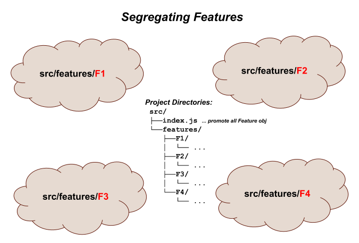
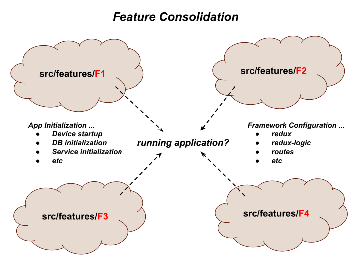
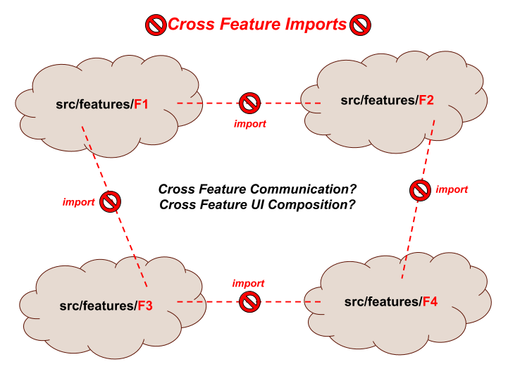
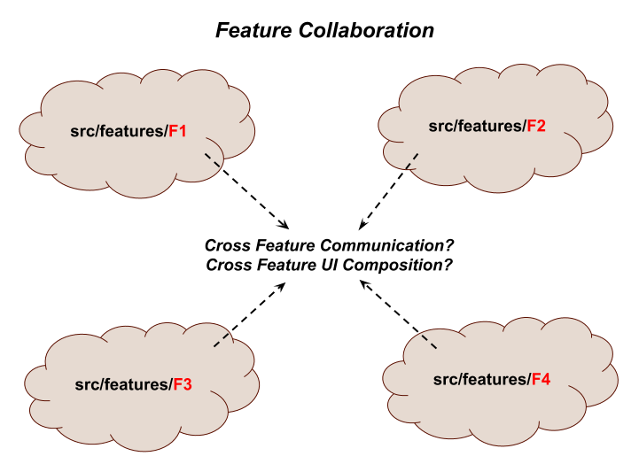

# feature-u V1 (Feature Based Project Organization for React)

This article is an introduction to a new JS library called
**[feature-u]**, that **facilitates feature-based project organization
in your [react] project**.  It provides tangible assistance in promoting
individual **plug-and-play** features within your project.

<!--- select new image

 ---> 

Most developers would agree that organizing your project by feature is
much preferred over type-based patterns. Because **application domains
grow** in the real world, project **organization by type simply
doesn't scale**, _it just becomes unmanageable_!

There are many good articles on this topic with insights on
feature-based design and structure _(see: [References] below
TK:medium-resolve-internal-link)_.  However when it comes to the
implementation, you are pretty much left to fend for yourself.

This article is an introduction to **feature-u**, building concepts and
insights.  It makes a case for why **feature-u** was developed and gives
you a better understanding of it's benefits.

Check out the [full docs], [github source], and [npm package].

**[feature-u]** opens new doors into the exciting world of
feature-based development.  It frees you up to **focus your attention
on the "business end" of your features!** _Go forth and compute!!_

---

**Note**: On 8/14/2018 [feature-u V1] was released, that re-designed
[Cross Feature Communication] to include [UI Composition] as a core
offering.  This article covers the V1 release.  _(the first article,
based on [feature-u V0], can be found
[here](http://bit.ly/feature-u))_.  We are very excited about this
update, because it **promotes one solution for all feature
collaboration**!

## At a Glance

TK:medium-resolve-internal-links

- [Feature Based Development] ... _? describe_
- [Segregating Features] ... _? describe_
- [Feature Goals] ... _? describe_
  - [Feature Runtime Consolidation] ... _? describe_
  - [Feature Collaboration] ... _? describe_

<!--- ?? consider refactoring diagram to use 3 features patterned after concepts ---> 

## Feature Based Development

At a 30,000 ft view, feature-based development _(as in most software)_
is all about dissecting hard problems into smaller pieces.  Even when I
started my carrier _(back in the 70's)_, this was a prominent
quote:

<ul>
<i>"All problems in computer science can be solved by another level of indirection." <b>David Wheeler</b></i>
</ul>

By breaking up your application into features, each feature can focus
on a more specific and isolated set of tasks.  **In some ways you can
think of a feature as a "mini application"**!

There are many design considerations in defining your feature
boundaries.  You can find several articles on this topic that provide
insight on feature-based design _(see: [References] below
TK:medium-resolve-internal-link)_.

For the most part, these considerations are part of the design of each
individual project.  While **feature-u** does not dictate overall
design considerations, it does however facilitate good feature-based
principles (such as encapsulation).  **This will be the focus of this
article**.

## Segregating Features

If you are like me, when you think about feature-based development,
the first thing that comes to mind is directories.  By segregating
your features into individual directories, there is a semblance of
isolation.

<!---

Diagram shows:

Feature Clouds

Project Directories:
  src/
  ├──index.js ... promote all Feature objects
  └──features/
     ├──F1/
     │  └── ...
     ├──F2/
     │  └── ...
     ├──F3/
     │  └── ...
     └──F4/
        └── ...
---> 

## Feature Goals

Our goal is to **encapsulate each feature** in such a way as to make
them truly **plug-and-play**.  _But how is this accomplished_?

The directory structure is just a start.  There are **several
hurdles** that must be overcome to realize our goal ...

- How do we encapsulate and isolate our features, while still
  allowing them to collaborate with one another?

- How can selected features introduce start-up initialization (_even
  injecting utility at the root DOM_), without relying on some external
  startup process?

- How can feature-based UI Composition be accomplished in an
  isolated and autonomous way?

- How do we configure our chosen frameworks now that our code is so
  spread out?

- How do we enable/disable selected features which are either
  optional, or require a license upgrade?

- **In short**, how do we achieve a running application from these
  isolated features?

Broadly speaking, there are two overriding characteristics that must
be accomplished to achieve our goal _(along with several other
byproducts)_:

<!--- ? Other Words: Accumulate, Consolidate, Pull/Bring together, Unite, Combine, Amalgamate, Join, Fuse, Unify ---> 

1. **Feature Runtime Consolidation**: pull together our features into one running application

2. **Feature Collaboration**: provide a mechanism by which our features can interact with one another

Let's take a closer look at each of these items.

## Feature Runtime Consolidation

<!--- ? alt title: Consolidating Features ---> 
<!--- ? alt title: Runtime Consolidation ---> 
<!--- ? alt title: Runtime Feature Consolidation ---> 
<!--- ? alt title: Combining Features into running App ---> 

Now that we have isolated our features into separate entities, how do
we bring them back together so they run as **one application**?
We must be able to pull and configure various aspects of our
individual features, and "launch" them as a single homogeneous running
application.

This concern can be further divided into two sub-concerns:

- App Initialization

  Some features may require certain startup initialization.  As an
  example, a feature that encapsolates some DB abstraction will rely
  on a run-time setup of a DB service.

  Certainly we don't want to rely on some global app logic to
  accomplish this _(once again, we want our features to be
  encapsolated and self-sufficient)_.

  <!--- DIAGRAM (included above) enumerating:
          App Initialization ...
          - Device startup
          - DB initialization
          - Service initialization
          - etc
  ---> 

- Framework Configuration

  If your application relys on other frameworks, chances are there are
  resources contained within each feature that must be accumulated and
  fed into the framework configuration process.

  How is this accomplished?

  <!--- DIAGRAM (included above) enumerating:
          Framework Configuration ...
          - redux
          - redux-logic
          - routes
          - etc
  ---> 

## Feature Collaboration

<!--- ? pretty much taken directly from crossCommunication.md inro PLUS new diagram ---> 

A **best practice** of feature-based development _(to the extent
possible)_ is to **treat each feature as an isolated implementation**.
Most aspects of a feature are internal to that feature's
implementation _(for example, actions are typically created and
consumed exclusively by logic/reducers/components that are internal to
that feature)_.

From this perspective, you can think of each feature as it's **own
isolated mini application**.

With that said however, we know that _"**no man is an island**"_!  Any
given feature ultimately exists as part of a larger application.
There are cases where a feature needs to promote a limited subset of
it's aspects to other features.  For example, a feature may need to:

 - be knowledgeable of some external state (via a selector)
 - emit or monitor actions of other features
 - consolidate component resources from other features - as in **UI Composition**
 - invoke the API of other features
 - etc. etc. etc.

These items form the basis of why **Cross Feature Communication** is
needed.

To complicate matters, as a general rule, **JS imports should NOT
cross feature boundaries**.  The reason being that this
cross-communication should be limited to public access points -
helping to **facilitate true plug-and-play**.

Given all this then, **how is Cross Feature Communication achieved**
_in a way that doesn't break encapsulation_?

Features need a way to promote their **Public Interface** to other
features, and consume other feature's **Public Assets**.

## The feature-u Solution

??? CURRENT POINT ???

<!--- ?? OLD WORDS

**the Goal _(what now?)_ ...** ?? OLD WORDS

<ul>

The **overriding goal** of **feature-u** is two fold:

1. Allow features to **Plug-and-Play!** This encompasses many things,
   such as: encapsulation, cross communication, enablement,
   initialization, etc., etc.  We will build on these concepts
   throughout this article.

2. **Automate the startup of your application!!** You have the
   features.  Allow them to promote their characteristics, so a
   central utility can **automatically configure the frameworks** used
   in your app, thereby **launching your application!** This task
   **must be accomplished in an extendable way**, _because not
   everyone uses the same set of frameworks!_

</ul>

 ---> 

<!--- ?? POINTS COVERED IN PRESENTATION: ... may be part of our goal buildup

How feature-u assists in:

- Feature Encapsulation  ...  isolating feature implementations
  improves code manageability ... you can think of features as simply
  "mini applications"

- Cross Feature Communication  ...  a feature's public API is promoted
  through a well-defined standard ... helping to make your features
  Plug-and-Play

- Feature Based UI Composition ... component composition can easily
  cross feature boundaries ... using a feature-u HoC (and something
  called resource contracts), cross-feature content injection is
  seamless (and can even be autonomous)

- Feature Enablement  ...  enable/disable features through a simple
  run-time switch

- Application Life Cycle Hooks  ...  features can initialize
  themselves without relying on an external process, greatly
  simplifying your mainline startup process

- Framework Integration  ...  using feature-u's extendable plugins,
  the frameworks of your choice (i.e. matching your run-time-stack)
  are seamlessly integrated into your features, and are
  auto-configured ... greatly simplifying their use and reducing
  boilerplate code

 ---> 

## References

- [A feature based approach to React development](http://ryanlanciaux.com/blog/2017/08/20/a-feature-based-approach-to-react-development/)
  _... Ryan Lanciaux_
  <!--
  KJB: very good high level stuff ... NOTED BY Jeff
       * general discussion
       * structure (SAME AS MINE)
           src
             features/
               cart/
                 components/
                 actionCreators.js
                 index.js
                 reducer.js
                 selectors.js
               product/
               other/
       * talks about a Feature Flag
         ... a technique to turn some functionality of your application off,
             via configuration, without deploying new code
  -->

- [How to better organize your React applications?](https://medium.com/@alexmngn/how-to-better-organize-your-react-applications-2fd3ea1920f1)
  _... Alexis Mangin_
  <!--
  KJB: more general discussion of react (without redux) ... NOTED BY Jeff
       * discusses scenes
  -->

- [How to use Redux on highly scalable javascript applications?](https://medium.com/@alexmngn/how-to-use-redux-on-highly-scalable-javascript-applications-4e4b8cb5ef38)
  _... Alexis Mangin_
  <!--
  KJB: very good discussion of breaking redux up into features (exactly what I am doing)
       * same author of above article: Alexis Mangin
  -->

- [The 100% correct way to structure a React app (or why there’s no such thing)](https://hackernoon.com/the-100-correct-way-to-structure-a-react-app-or-why-theres-no-such-thing-3ede534ef1ed)
  _... David Gilbertson_
  <!--
  KJB: more interested in file usage/accessibility (large hit count)
  -->

- [Redux for state management in large web apps](https://blog.mapbox.com/redux-for-state-management-in-large-web-apps-c7f3fab3ce9b)
  _... David Clark_
  <!--
  KJB: NOT directly feature related, HOWEVER points out several feature-based items, such as sliced reducers
  -->

  <!-- KJB: OMIT: marginal value
- [How to structure real world Redux/React application](https://medium.com/@yiquanzhou/how-to-structure-real-world-redux-react-application-d61e66a7dd36)
  _... Yiquan Zhou_
  -->

<!--- ?? insure all refs used, and resync as necessary ---> 

<!--- ?? internal references ---> 

[Feature Based Development]:      #feature-based-development
[Segregating Features]:           #segregating-features
[Feature Goals]:                  #feature-goals
[Feature Runtime Consolidation]:  #feature-runtime-consolidation
[Feature Collaboration]:          #feature-collaboration

[References]:                     #references

<!--- ?? eatery-nod ---> 
[eatery-nod]:   https://github.com/KevinAst/eatery-nod/tree/after-features
[README]:       https://github.com/KevinAst/eatery-nod/blob/after-features/README.md
[src BEFORE]:   https://github.com/KevinAst/eatery-nod/tree/before-features/src
[src AFTER]:    https://github.com/KevinAst/eatery-nod/tree/after-features/src
[README files]: https://github.com/KevinAst/eatery-nod/blob/after-features/src/feature/README.md
[device]:       https://github.com/KevinAst/eatery-nod/blob/after-features/src/feature/device/README.md
[auth]:         https://github.com/KevinAst/eatery-nod/blob/after-features/src/feature/auth/README.md
[leftNav]:      https://github.com/KevinAst/eatery-nod/blob/after-features/src/feature/leftNav/README.md
[currentView]:  https://github.com/KevinAst/eatery-nod/blob/after-features/src/feature/currentView/README.md
[eateries]:     https://github.com/KevinAst/eatery-nod/blob/after-features/src/feature/eateries/README.md
[discovery]:    https://github.com/KevinAst/eatery-nod/blob/after-features/src/feature/discovery/README.md
[firebase]:     https://github.com/KevinAst/eatery-nod/blob/after-features/src/feature/firebase/README.md
[logActions]:   https://github.com/KevinAst/eatery-nod/blob/after-features/src/feature/logActions/README.md
[sandbox]:      https://github.com/KevinAst/eatery-nod/blob/after-features/src/feature/sandbox/README.md

<!--- ?? feature-u ---> 
[feature-u]:          https://feature-u.js.org/
[full docs]:          https://feature-u.js.org/
[full documentation]: https://feature-u.js.org/
[github source]:      https://github.com/KevinAst/feature-u
[npm package]:        https://www.npmjs.com/package/feature-u

[feature-u V0]:       https://feature-u.js.org/0.1.3/history.html#v0_1_3
[feature-u V1]:       https://feature-u.js.org/1.0.0/history.html#v1_0_0

[Launching Your Application]:   https://feature-u.js.org/1.0.0/detail.html#launching-your-application
[Feature & aspect content]:     https://feature-u.js.org/1.0.0/detail.html#feature-object-relaying-aspect-content
[Extendable aspects]:           https://feature-u.js.org/1.0.0/detail.html#extendable-aspects
[React Registration]:           https://feature-u.js.org/1.0.0/detail.html#react-registration
[Cross Feature Communication]:  https://feature-u.js.org/1.0.0/crossCommunication.html
[UI Composition]:               https://feature-u.js.org/1.0.0/crossCommunication.html#ui-composition
[Application Life Cycle Hooks]: https://feature-u.js.org/1.0.0/appLifeCycle.html
[Built-In aspect]:              https://feature-u.js.org/1.0.0/detail.html#built-in-aspects
[Feature Enablement]:           https://feature-u.js.org/1.0.0/enablement.html
[Managed Code Expansion]:       https://feature-u.js.org/1.0.0/crossCommunication.html#managed-code-expansion
[Feature Based Routes]:         https://feature-u.js.org/1.0.0/featureRouter.html
[Best Practices]:               https://feature-u.js.org/1.0.0/bestPractices.html
[extendable]:                   https://feature-u.js.org/1.0.0/extending.html

[`Feature`]:        https://feature-u.js.org/1.0.0/api.html#Feature
[`App`]:            https://feature-u.js.org/1.0.0/api.html#App

[`createFeature()`]:       https://feature-u.js.org/1.0.0/api.html#createFeature
[`launchApp()`]:           https://feature-u.js.org/1.0.0/api.html#launchApp
[`registerRootAppElm()`]:  https://feature-u.js.org/1.0.0/api.html#registerRootAppElmCB

[`Feature.appWillStart()`]:                                           https://feature-u.js.org/1.0.0/appLifeCycle.html#appwillstart
[`Feature.appWillStart({app, curRootAppElm}): rootAppElm || falsy`]:  https://feature-u.js.org/1.0.0/appLifeCycle.html#appwillstart

[`Feature.appDidStart()`]:                                https://feature-u.js.org/1.0.0/appLifeCycle.html#appDidStart
[`Feature.appDidStart({app, appState, dispatch}): void`]: https://feature-u.js.org/1.0.0/appLifeCycle.html#appDidStart

[`managedExpansion()`]:    https://feature-u.js.org/1.0.0/api.html#managedExpansion

[`createAspect()`]:        https://feature-u.js.org/1.0.0/api.html#createAspect

[feature-redux]:     https://github.com/KevinAst/feature-redux
[`slicedReducer()`]: https://github.com/KevinAst/feature-redux#slicedreducer

[feature-router]:     https://github.com/KevinAst/feature-router

<!--- external links ---> 
[react]:            https://reactjs.org/

[react web]:        https://reactjs.org/
[react-native]:     https://facebook.github.io/react-native/
[expo]:             https://expo.io/

[redux]:            http://redux.js.org/
[redux-logic]:      https://github.com/jeffbski/redux-logic

[astx-redux-util]:  https://astx-redux-util.js.org/
[`reducerHash()`]:  https://astx-redux-util.js.org/1.0.0/api.html#reducerHash

[Higher-Order Reducers]: https://medium.com/@mange_vibration/reducer-composition-with-higher-order-reducers-35c3977ed08f
