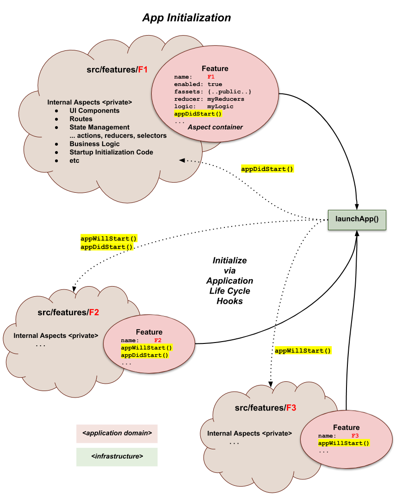

# feature-u V1 (Feature Based Project Organization for React)

This article is an introduction to a new JS library called
**[feature-u]**, that **facilitates feature-based project organization
in your [react] project**.  It provides tangible assistance in promoting
individual **plug-and-play** features within your project.

<p align="center"></p>
<!--- select new image
<p align="center"></p>
<p align="center"></p>
<p align="center"></p>
 ---> 

Most developers would agree that organizing your project by feature is
much preferred over type-based patterns. Because **application domains
grow** in the real world, project **organization by type simply
doesn't scale**, _it just becomes unmanageable_!

There are many good articles on this topic with insights on
feature-based design and structure _(see: [References] below
TK:medium-resolve-internal-link)_.  However when it comes to the
implementation, you are pretty much left to fend for yourself.

This article is an introduction to **feature-u**, building concepts and
insights.  It makes a case for why **feature-u** was developed and gives
you a better understanding of it's benefits.

Check out the [full docs], [github source], and [npm package].

**[feature-u]** opens new doors into the exciting world of
feature-based development.  It frees you up to **focus your attention
on the "business end" of your features!** _Go forth and compute!!_

---

**Note**: On 8/14/2018 [feature-u V1] was released, that re-designed
[Cross Feature Communication] to include [UI Composition] as a core
offering.  This article covers the V1 release.  _(the first article,
based on [feature-u V0], can be found
[here](http://bit.ly/feature-u))_.  We are very excited about this
update, because it **promotes one solution for all feature
collaboration**!


## At a Glance

TK:medium-resolve-internal-links

- [Feature Based Development] ... _think of features as mini applications_
  - [Segregating Features] ... _divide your features into directories_
  - [Feature Goals] ... _what are the goals and hurdles of feature based development_
    - [Feature Runtime Consolidation] ... _how do multiple features run as one application?_
    - [Feature Collaboration] ... _how do features cross communicate without breaking encapsulation?_
- [The feature-u Solution] ... _how can **feature-u** help?_
  - [launchApp()]
  - [Feature Object]
  - [aspects]
  - [Running the App]
    - [App Initialization]
    - [Framework Configuration]
  - [Cross Feature Communication](#cross-feature-communication)
  - [Feature Based UI Composition]
    - [Resource Contracts]
  - [Feature Enablement](#feature-enablement)

<!--- ? consider refactoring diagram to use 3 features patterned after concepts
      ? I THINK WE CAN MOVE TO 3 clouds anytime we want
 ---> 

## Feature Based Development

At a 30,000 ft view, feature-based development _(as in most software)_
is all about dissecting hard problems into smaller pieces.  Even when I
started my carrier _(back in the 70's)_, this was a prominent
quote:

<ul>
<i>"All problems in computer science can be solved by another level of indirection." <b>David Wheeler</b></i>
</ul>

By breaking up your application into features, each feature can focus
on a more specific and isolated set of tasks.  **In some ways you can
think of a feature as a "mini application"**!

There are many design considerations in defining your feature
boundaries.  You can find several articles on this topic that provide
insight on feature-based design _(see: [References] below
TK:medium-resolve-internal-link)_.

For the most part, these considerations are part of the design of each
individual project.  While **feature-u** does not dictate overall
design considerations, it does however facilitate good feature-based
principles (such as encapsulation).  **This will be the focus of this
article**.

## Segregating Features

If you are like me, when you think about feature-based development,
the first thing that comes to mind is directories.  By segregating
your features into individual directories, there is a semblance of
isolation.

<p align="center"></p>

<!---

Diagram shows:

Feature Clouds

Project Directories:
  src/
  ├──index.js ... promote all Feature objects
  └──features/
     ├──F1/
     │  └── ...
     ├──F2/
     │  └── ...
     ├──F3/
     │  └── ...
     └──F4/
        └── ...
---> 

## Feature Goals

Our goal is to **encapsulate each feature** in such a way as to make
them truly **plug-and-play**.  _But how is this accomplished_?

The directory structure is just a start.  There are **several
hurdles** that must be overcome to realize our goal ...

- How do we encapsulate and isolate our features, while still
  allowing them to collaborate with one another?

- How can selected features introduce start-up initialization (_even
  injecting utility at the root DOM_), without relying on some external
  startup process?

- How can feature-based UI Composition be accomplished in an
  isolated and autonomous way?

- How do we configure our chosen frameworks now that our code is so
  spread out?

- How do we enable/disable selected features which are either
  optional, or require a license upgrade?

**In short**, how do we achieve a running application from these
isolated features?

When you boil it all down, there are **two overriding
characteristics** that must be accomplished to achieve our goals:

<!--- ? Other Words: Accumulate, Consolidate, Pull/Bring together, Unite, Combine, Amalgamate, Join, Fuse, Unify ---> 

1. **[Feature Runtime Consolidation]**: _pulling our features back together into one running application_

2. **[Feature Collaboration]**: _provide a mechanism by which our features can interact with one another_


As it turns out, _everything else is a byproduct of these two
artifacts_. Let's take a closer look at each of these items.


<!--- ? OLD WORDS

**the Goal _(what now?)_ ...**

<ul>

The **overriding goal** of **feature-u** is two fold:

1. Allow features to **Plug-and-Play!** This encompasses many things,
   such as: encapsulation, cross communication, enablement,
   initialization, etc., etc.  We will build on these concepts
   throughout this article.

2. **Automate the startup of your application!!** You have the
   features.  Allow them to promote their characteristics, so a
   central utility can **automatically configure the frameworks** used
   in your app, thereby **launching your application!** This task
   **must be accomplished in an extendable way**, _because not
   everyone uses the same set of frameworks!_

</ul>

 ---> 


## Feature Runtime Consolidation

<!--- ? alt title: Consolidating Features ---> 
<!--- ? alt title: Runtime Consolidation ---> 
<!--- ? alt title: Runtime Feature Consolidation ---> 
<!--- ? alt title: Combining Features into running App ---> 

Now that we have isolated our features into separate entities, how do
we bring them back together so they run as **one application**?
We must be able to pull and configure various aspects of our
individual features, and "launch" them as a single homogeneous running
application.

<p align="center"></p>

This concern can be further divided into two sub-concerns:

- [App Initialization]

  Some features may require certain startup initialization.  As an
  example, a feature that encapsulates some DB abstraction will rely
  on a run-time setup of a DB service.

  Certainly we don't want to rely on some global app logic to
  accomplish this _(once again, we want our features to be
  encapsulated and self-sufficient)_.

  <!--- DIAGRAM (included above) enumerating:
          App Initialization ...
          - Device startup
          - DB initialization
          - Service initialization
          - etc
  ---> 

- [Framework Configuration]

  If your application relies on other frameworks, chances are there are
  resources contained within each feature that must be accumulated and
  fed into the framework configuration process.

  How is this accomplished?

  <!--- DIAGRAM (included above) enumerating:
          Framework Configuration ...
          - redux
          - redux-logic
          - routes
          - etc
  ---> 


## Feature Collaboration

The second overriding goal (mentioned above) is **Feature
Collaboration** - _providing a mechanism by which our features can
interact with one another_.

<!--- ? pretty much taken directly from crossCommunication.md intro PLUS new diagram ---> 

A **best practice** of feature-based development _(to the extent
possible)_ is to **treat each feature as an isolated implementation**.
Most aspects of a feature are internal to that feature's
implementation _(for example, actions are typically created and
consumed exclusively by logic/reducers/components that are internal to
that feature)_.

From this perspective, you can think of each feature as it's **own
isolated mini application**.

With that said however, we know that _"**no man is an island**"_!  Any
given feature ultimately exists as part of a larger application.
There are cases where a feature needs to promote a limited subset of
it's aspects to other features.  For example, a feature may need to:

 - be knowledgeable of some external state (via a selector)
 - emit or monitor actions of other features
 - consolidate component resources from other features - as in **UI Composition**
 - invoke the API of other features
 - etc. etc. etc.

These items form the basis of why **[Cross Feature Communication](#cross-feature-communication)** and
**[Feature Based UI Composition]** is needed.

<p align="center"></p>

To complicate matters, as a general rule, **JS imports should NOT
cross feature boundaries**.  The reason being that this
cross-communication should be **limited to public access points** -
helping to **facilitate true plug-and-play**.

<p align="center"></p>

Given all this then, **how is Cross Feature Communication achieved**
_in a way that doesn't break encapsulation_?

Features need a way to promote their **Public Interface** to other
features, and consume other feature's **Public Assets**.


<!--- ?? POINTS COVERED IN PRESENTATION: ... may be part of our goal buildup

How feature-u assists in:

- Feature Encapsulation  ...  isolating feature implementations
  improves code manageability ... you can think of features as simply
  "mini applications"

- Cross Feature Communication  ...  a feature's public API is promoted
  through a well-defined standard ... helping to make your features
  Plug-and-Play

- Feature Based UI Composition ... component composition can easily
  cross feature boundaries ... using a feature-u HoC (and something
  called resource contracts), cross-feature content injection is
  seamless (and can even be autonomous)

- Feature Enablement  ...  enable/disable features through a simple
  run-time switch

- Application Life Cycle Hooks  ...  features can initialize
  themselves without relying on an external process, greatly
  simplifying your mainline startup process

- Framework Integration  ...  using feature-u's extendable plugins,
  the frameworks of your choice (i.e. matching your run-time-stack)
  are seamlessly integrated into your features, and are
  auto-configured ... greatly simplifying their use and reducing
  boilerplate code

 ---> 


## The feature-u Solution

Let's take a look at the **feature-u** solution for all of theses
items.  

The following sections will build **feature-u** concepts
incrementally.


### launchApp()

[`launchApp()`] is an essential utility in **feature-u**.  It is an
agent, working on your behalf, which provides the foundation that
**accomplishes all the goals** of **feature-u**!  It facilitates both
**[Feature Runtime Consolidation]** and **[Feature Collaboration]**.

With this utility, **your mainline startup process is extremely
simple** ... it merely invokes `launchApp()`, and you are done!

<p align="center"></p>

The `launchApp()` function actually starts your application running,
employing various hooks that drive BOTH **App Initialization** and
**Framework Configuration**!

**How does this work?  _What are the bindings to `launchApp()`_**?
... _let's delve a bit deeper_


### Feature Object

To accomplish this, each feature promotes a [`Feature`] object _(using
[`createFeature()`])_, that catalogs aspects of interest to
**feature-u**.

This is the primary input to [`launchApp()`].

<p align="center"></p>


### aspects

In **feature-u**, "aspect" _(little "a")_ is a generalized term used
to refer to the various ingredients that (when combined) constitute
your application.  Aspects can take on many different forms: **UI
Components** &bull; **Routes** &bull; **State Management** _(actions,
reducers, selectors)_ &bull; **Business Logic** &bull; **Startup
Initialization Code** &bull; _etc. etc. etc._

**Not all aspects are of interest to feature-u** ...  _only those that
are needed to setup and launch the application_ ... all others are
considered an internal implementation detail of the feature.  As an
example, consider the redux state manager: while it uses actions,
reducers, and selectors ... only reducers are needed to setup and
configure redux.

<p align="center"></p>

The [`Feature`] object is merely a lightweight container that holds
aspects of interest to **feature-u**.  These aspects can either be
**built-in** (from core **feature-u**), or **extensions**.


### Running the App

Let's see how [`launchApp()`] accommodates the two sub-goals of running the app:

- [App Initialization]
- [Framework Configuration]

### App Initialization

Because `launchApp()` is in control of starting the app, it can
introduce [Application Life Cycle Hooks].

This allows each feature to perform app-specific initialization, and
even inject components into the root of the app.

There are two hooks:

1. [`Feature.appWillStart`] - invoked one time at app startup time
2. [`Feature.appDidStart`]   - invoked one time immediately after app has started

<p align="center"></p>

[Application Life Cycle Hooks] **greatly simplify your app's mainline
startup process**, because _initialization specific to a given feature
**can be encapsulated in that feature**_.

### Framework Configuration

A fundamental goal of **feature-u** is to **automatically configure
the framework(s)** used in your run-time-stack _(by accumulating the
necessary resources across all your features)_.  This greatly reduces
the boilerplate code within your app.

How can this be accomplished when there are so many frameworks out
there ... and every project uses a different mix?

**feature-u** is extendable!  It operates in an open plugable
architecture where **Extendable Aspects** integrate **feature-u** to other
frameworks, matching your specific run-time stack.  **This is good,**
_because not everyone uses the same frameworks_!

**Extendable Aspects** can be found in external NPM packages _(the normal case)_, or you
can create your own using [`createAspect()`] _(a more advanced topic)_.

<p align="center"></p>

The [`Aspect`] object contains a series of [Aspect Life Cycle Hooks] that are
invoked under the control of **feature-u** ([`launchApp()`]).
In general, an Aspect's responsibility is to:

- accumulate [`AspectContent`] across all features
- perform some desired setup and configuration
- expose it's functionality in some way (typically a framework integration)

An [`Aspect`] automatically extends the [`Feature`] object by allowing
it's [`AspectContent`] to be **"cataloged"** in the `Feature` using
`Aspect.name` as it's key.  In the diagram above, you can see that

- the `reducerAspect` (`Aspect.name: 'reducer'`) permits a
  `Feature.reducer: reducerContent` construct

- and the `logicAspect` (`Aspect.name: 'logic'`) permits a
  `Feature.logic: logicContent` construct

It is important to understand that the interface to your chosen
frameworks is not altered in any way.  You use them the same way you
always have _(just within your feature boundary)_.  **feature-u**
merely provides a well defined organizational layer, where the
frameworks are automatically setup and configured by accumulating the
necessary resources across all your features.


## Cross Feature Communication

In support of **Feature Collaboration** _that doesn't break
encapsulation_, **feature-u** promotes feature-based resources through
something called `fassets` (feature assets).  This is how all **Cross
Feature Communication** is accomplished.  You can think of this as the
**Public Face** of a feature.

**SideBar**: The term `fassets` is a play on words.  While it is
pronounced "facet" _and is loosely related to this term_, it is spelled
fassets (i.e. feature assets).

A feature can expose whatever it deems necessary through the built-in
{{book.api.fassetsAspect$}}).  There is no real constraint on this
resource.  It is truly open.

<p align="center"></p>

The {{book.api.fassetsAspect}} has a `define` directive where
resources are cataloged.

Here is a simple example of how `fassets` are defined:

```js
export default createFeature({

  name:     'featureA',

  fassets: {
    define: {
     'openView':      actions.view.open,      // openView(viewName): Action
     'currentView':   selector.currentView,   // currentView(appState): viewName
     'isDeviceReady': selector.isDeviceReady, // isDeviceReady(appState): boolean
    },
  },

  ...
});
```

**feature-u** accumulates `fassets` from all active features, and
promotes them through the {{book.api.FassetsObject}} _(emitted from
{{book.api.launchApp}})_.

**SideBar**: There are several ways to obtain access the `Fassets
object` _(see {{book.guide.crossCom_obtainingFassetsObject}})_.

To reference a `fassets` resource, simply dereference it as any other
object reference.  There is also a {{book.api.Fassets_get}} method
that can be supplied {{book.guide.crossCom_wildcards}}, returning an
array of resources.

This is an example of a **push** philosophy.  Here the supplier is is
simply publicly promoting a resource for other features to use **(take
it or leave it)**.  The supplier is merely saying: _"this is my Public
Face"_.


## Feature Based UI Composition

It is common for a UI component to be an accumulation of
sub-components that span several features.  As a result, **UI
Composition is a very important part of Cross Feature Communication**.

In support of this, **feature-u** introduces the
{{book.api.withFassets}} Higher-order Component (HoC) that auto-wires
fasset properties into a component.  This is a common pattern
popularized by redux `connect()` _(simplifying component access to
application state)_.

Here is how a component would access a `company.logo` _(defined
by another feature)_:

```js
function MyComponent({Logo}) {
  return (
    <div>
      <Logo/>
    </div>
    ... snip snip
  );
}

export default withFassets({
  component: MyComponent,
  mapFassetsToProps: {
    Logo: 'company.logo',
  }
});
```

The {{book.api.withFassets}} HoC auto-wires named feature assets as
component properties through the `mapFassetsToProps` hook.  In this
example, because the `Logo` property is a component, `MyComponent` can
simply reference it using JSX.


## Resource Contracts

It is common for UI Composition to be represented as a contract, where
a component in one feature has a series of injection needs that are to
be supplied by other features.

The {{book.api.fassetsAspect}} has additional constructs to facilitate
this contractual arrangement, allowing **feature-u** to provide more
validation in the process.

Rather than just defining resources in one feature and using them in
another:

- A given feature can specify a series of injection needs using the
  `fassets.use` directive.  This identifies a set of **injection keys**
  that uniquely identify these resources.

- Other features will supply this content using the `fassets.defineUse`
  directive, by referencing these same **injection keys**.

This represents more of a **pull** philosophy.  It gives **feature-u**
more knowledge of the process, allowing it to verify that supplied
resources are correct.

Wildcards (`*`) can be used to add additional dynamics to the process,
allowing features to inject their content autonomously.

Here is a `main` feature that is pulling in a series of sub-components
_(links and bodies)_ from other features:

- **main feature**

  `src/features/main/index.js`
  ```js
  createFeature({
    name: 'main',

    fassets: {
      use: [
         'MainPage.*.link',
         'MainPage.*.body',
      ],
    },
    ... snip snip
  });
  ```

  Because our specification includes wildcards, a series of
  definitions will match!

  Here is the `MainPage` component that fulfills the usage contract:

  `src/features/main/comp/MainPage.js`
  ```js
  function MainPage({Logo, mainLinks, mainBodies}) {
    return (
      <div>
        <div> {/* header section */}
          <Logo/>
        </div>

        <div> {/* left-nav section */}
          {mainLinks.map( (MainLink, indx) => <MainLink key={indx}/>)}
        </div>

        <div> {/* body section */}
          {mainBodies.map( (MainBody, indx) => <MainBody key={indx}/>)}
        </div>
      </div>
    );
  }

  export default withFassets({
    component: MainPage,
    mapFassetsToProps: {
      Logo:       'company.logo',    // from our prior example

      mainLinks:  'MainPage.*.link', // find matching
      mainBodies: 'MainPage.*.body',
    },
  });
  ```

When {{book.api.withFassets}} encounters wildcards (`*`), it merely
accumulates all matching definitions, and promotes them as arrays.

Through this implementation, **any feature may dynamically inject
itself in the process autonomously**!  In addition, this dynamic
implicitly handles the case where a feature is dynamically disabled
_**(very kool indeed)**_!!

The following snippets are taken from other features that supply the
definitions for the content to inject:

- **cart feature**

  `src/features/cart/index.js`
  ```js
  createFeature({
    name: 'cart',

    fassets: {
      defineUse: {
       'MainPage.cart.link': () => <Link to="/cart">Cart</Link>,
       'MainPage.cart.body': () => <Route path="/cart" component={ShoppingCart}/>,
      },
    },
    ... snip snip
  });
  ```

- **search feature**

  `src/features/search/index.js`
  ```js
  createFeature({
    name: 'search',

    fassets: {
      defineUse: {
       'MainPage.search.link': () => <Link to="/search">Search</Link>,
       'MainPage.search.body': () => <Route path="/search" component={Search}/>,
      },
    },
    ... snip snip
  });
  ```

Two external features (**cart** and **search**) define the content
that is requested by the **main** feature.

The `fassets.defineUse` directive requires that the resource keys match a
`fassets.use` feature request.  This is the contract that provides
**feature-u** insight when enforcing it's validation.

**SideBar**: Because we are also dealing with navigation, we introduce
{{book.ext.reactRouter}} into the mix (with the `Link` and `Route`
components).  Because of RR's V4 design, our routes are also handled
through component composition _(see {{book.guide.featureRouter}} for
more information)_.


## Feature Enablement

Features can be can be dynamically disabled by setting the
`Feature.enabled` boolean property _(part of the
{{book.guide.detail_builtInAspects}})_:

```js
export default createFeature({
  name:     'sandbox',
  enabled:  false,
  ... snip snip
});
```

In this example, it is just as though the `sandbox` feature doesn't
exist.  In other words **it has been logically removed**.

Typically, this indicator is based on some run-time expression,
allowing packaged code to be dynamically enabled/disabled during the
application's start-up process:

```js
export default createFeature({
  name:     'sandbox',
  enabled:  inDevelopmentMode(),
  ... snip snip
});
```

This dynamic is useful in a number of different situations. For
example:

- some features may require a license upgrade

- other features may only be used for diagnostic purposes, and are
  disabled by default

This topic is discussed in more detail at [Feature Enablement].


## References

- [A feature based approach to React development](http://ryanlanciaux.com/blog/2017/08/20/a-feature-based-approach-to-react-development/)
  _... Ryan Lanciaux_
  <!--
  KJB: very good high level stuff ... NOTED BY Jeff
       * general discussion
       * structure (SAME AS MINE)
           src
             features/
               cart/
                 components/
                 actionCreators.js
                 index.js
                 reducer.js
                 selectors.js
               product/
               other/
       * talks about a Feature Flag
         ... a technique to turn some functionality of your application off,
             via configuration, without deploying new code
  -->

- [How to better organize your React applications?](https://medium.com/@alexmngn/how-to-better-organize-your-react-applications-2fd3ea1920f1)
  _... Alexis Mangin_
  <!--
  KJB: more general discussion of react (without redux) ... NOTED BY Jeff
       * discusses scenes
  -->

- [How to use Redux on highly scalable javascript applications?](https://medium.com/@alexmngn/how-to-use-redux-on-highly-scalable-javascript-applications-4e4b8cb5ef38)
  _... Alexis Mangin_
  <!--
  KJB: very good discussion of breaking redux up into features (exactly what I am doing)
       * same author of above article: Alexis Mangin
  -->

- [The 100% correct way to structure a React app (or why there’s no such thing)](https://hackernoon.com/the-100-correct-way-to-structure-a-react-app-or-why-theres-no-such-thing-3ede534ef1ed)
  _... David Gilbertson_
  <!--
  KJB: more interested in file usage/accessibility (large hit count)
  -->

- [Redux for state management in large web apps](https://blog.mapbox.com/redux-for-state-management-in-large-web-apps-c7f3fab3ce9b)
  _... David Clark_
  <!--
  KJB: NOT directly feature related, HOWEVER points out several feature-based items, such as sliced reducers
  -->

  <!-- KJB: OMIT: marginal value
- [How to structure real world Redux/React application](https://medium.com/@yiquanzhou/how-to-structure-real-world-redux-react-application-d61e66a7dd36)
  _... Yiquan Zhou_
  -->


<!--- ?? insure all refs used, and resync as necessary ---> 

<!--- ?? internal references ---> 

[Feature Based Development]:          #feature-based-development
 [Segregating Features]:              #segregating-features
 [Feature Goals]:                     #feature-goals
  [Feature Runtime Consolidation]:    #feature-runtime-consolidation
  [Feature Collaboration]:            #feature-collaboration
[The feature-u Solution]:             #the-feature-u-solution
 [launchApp()]:                       #launchapp
 [Feature Object]:                    #feature-object
 [aspects]:                           #aspects
 [Running the App]:                   #running-the-app
  [App Initialization]:               #app-initialization
  [Framework Configuration]:          #framework-configuration
 [Cross Feature Communication LOCAL]: #cross-feature-communication
 [Feature Based UI Composition]:      #feature-based-ui-composition
  [Resource Contracts]:               #resource-contracts

                                       
[References]:                         #references


<!--- ?? eatery-nod ---> 
[eatery-nod]:   https://github.com/KevinAst/eatery-nod/tree/after-features
[README]:       https://github.com/KevinAst/eatery-nod/blob/after-features/README.md
[src BEFORE]:   https://github.com/KevinAst/eatery-nod/tree/before-features/src
[src AFTER]:    https://github.com/KevinAst/eatery-nod/tree/after-features/src
[README files]: https://github.com/KevinAst/eatery-nod/blob/after-features/src/feature/README.md
[device]:       https://github.com/KevinAst/eatery-nod/blob/after-features/src/feature/device/README.md
[auth]:         https://github.com/KevinAst/eatery-nod/blob/after-features/src/feature/auth/README.md
[leftNav]:      https://github.com/KevinAst/eatery-nod/blob/after-features/src/feature/leftNav/README.md
[currentView]:  https://github.com/KevinAst/eatery-nod/blob/after-features/src/feature/currentView/README.md
[eateries]:     https://github.com/KevinAst/eatery-nod/blob/after-features/src/feature/eateries/README.md
[discovery]:    https://github.com/KevinAst/eatery-nod/blob/after-features/src/feature/discovery/README.md
[firebase]:     https://github.com/KevinAst/eatery-nod/blob/after-features/src/feature/firebase/README.md
[logActions]:   https://github.com/KevinAst/eatery-nod/blob/after-features/src/feature/logActions/README.md
[sandbox]:      https://github.com/KevinAst/eatery-nod/blob/after-features/src/feature/sandbox/README.md


<!--- ?? feature-u ---> 
[feature-u]:          https://feature-u.js.org/
[full docs]:          https://feature-u.js.org/
[full documentation]: https://feature-u.js.org/
[github source]:      https://github.com/KevinAst/feature-u
[npm package]:        https://www.npmjs.com/package/feature-u

[feature-u V0]:       https://feature-u.js.org/0.1.3/history.html#v0_1_3
[feature-u V1]:       https://feature-u.js.org/1.0.0/history.html#v1_0_0

[Launching Your Application]:   https://feature-u.js.org/1.0.0/detail.html#launching-your-application
[Feature & aspect content]:     https://feature-u.js.org/1.0.0/detail.html#feature-object-relaying-aspect-content
[Extendable aspects]:           https://feature-u.js.org/1.0.0/detail.html#extendable-aspects
[React Registration]:           https://feature-u.js.org/1.0.0/detail.html#react-registration
[Cross Feature Communication]:  https://feature-u.js.org/1.0.0/crossCommunication.html
[UI Composition]:               https://feature-u.js.org/1.0.0/crossCommunication.html#ui-composition
[Application Life Cycle Hooks]: https://feature-u.js.org/1.0.0/appLifeCycle.html
[`Feature.appWillStart`]:       https://feature-u.js.org/1.0.0/appLifeCycle.html#appwillstart
[`Feature.appDidStart`]:        https://feature-u.js.org/1.0.0/appLifeCycle.html#appdidstart
[Built-In aspect]:              https://feature-u.js.org/1.0.0/detail.html#built-in-aspects
[Feature Enablement]:           https://feature-u.js.org/1.0.0/enablement.html
[Managed Code Expansion]:       https://feature-u.js.org/1.0.0/crossCommunication.html#managed-code-expansion
[Feature Based Routes]:         https://feature-u.js.org/1.0.0/featureRouter.html
[Best Practices]:               https://feature-u.js.org/1.0.0/bestPractices.html
[extendable]:                   https://feature-u.js.org/1.0.0/extending.html
[Aspect Life Cycle Hooks]:      https://feature-u.js.org/1.0.0/extending.html#aspect-life-cycle-methods
[`AspectContent`]:              https://feature-u.js.org/1.0.0/api.html#AspectContent
[`Aspect`]:                     https://feature-u.js.org/1.0.0/api.html#Aspect


[`Feature`]:        https://feature-u.js.org/1.0.0/api.html#Feature
[`App`]:            https://feature-u.js.org/1.0.0/api.html#App

[`createFeature()`]:       https://feature-u.js.org/1.0.0/api.html#createFeature
[`launchApp()`]:           https://feature-u.js.org/1.0.0/api.html#launchApp
[`registerRootAppElm()`]:  https://feature-u.js.org/1.0.0/api.html#registerRootAppElmCB

[`Feature.appWillStart()`]:                                           https://feature-u.js.org/1.0.0/appLifeCycle.html#appwillstart
[`Feature.appWillStart({app, curRootAppElm}): rootAppElm || falsy`]:  https://feature-u.js.org/1.0.0/appLifeCycle.html#appwillstart

[`Feature.appDidStart()`]:                                https://feature-u.js.org/1.0.0/appLifeCycle.html#appDidStart
[`Feature.appDidStart({app, appState, dispatch}): void`]: https://feature-u.js.org/1.0.0/appLifeCycle.html#appDidStart

[`managedExpansion()`]:    https://feature-u.js.org/1.0.0/api.html#managedExpansion

[`createAspect()`]:        https://feature-u.js.org/1.0.0/api.html#createAspect

[feature-redux]:     https://github.com/KevinAst/feature-redux
[`slicedReducer()`]: https://github.com/KevinAst/feature-redux#slicedreducer

[feature-router]:     https://github.com/KevinAst/feature-router

<!--- external links ---> 
[react]:            https://reactjs.org/

[react web]:        https://reactjs.org/
[react-native]:     https://facebook.github.io/react-native/
[expo]:             https://expo.io/

[redux]:            http://redux.js.org/
[redux-logic]:      https://github.com/jeffbski/redux-logic

[astx-redux-util]:  https://astx-redux-util.js.org/
[`reducerHash()`]:  https://astx-redux-util.js.org/1.0.0/api.html#reducerHash

[Higher-Order Reducers]: https://medium.com/@mange_vibration/reducer-composition-with-higher-order-reducers-35c3977ed08f
