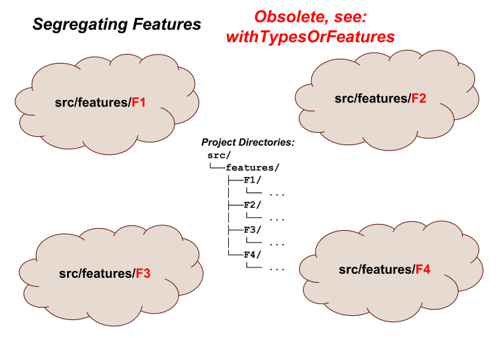
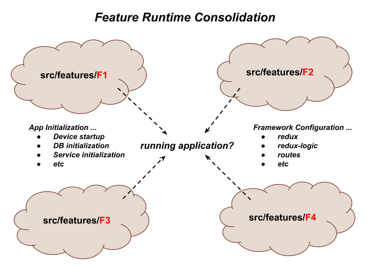

# Basic Concepts
          
This section will **introduce you to feature-based development** and
_build up high-level **feature-u** concepts_.

<p align="center"></p>

## Feature Based Development

At a 30,000 ft view, feature-based development _(as in most software)_
is all about dissecting hard problems into smaller pieces.  Even when I
started my career _(back in the 70's)_, this was a prominent
quote:

<ul>
<i>"All problems in computer science can be solved by another level of indirection." <b>David Wheeler</b></i>
</ul>

By breaking up your application into features, each feature can focus
on a more specific and isolated set of tasks.  **In some ways you can
think of a feature as a "mini application"**!

There are many design considerations in defining your feature
boundaries.  You can find several articles on this topic that provide
insight on feature-based design.

For the most part, these considerations are part of the design of each
individual project.  While **feature-u** does not dictate overall
design considerations, it does however facilitate good feature-based
principles (such as encapsulation).  _This will be the focus of this
section_.

## Segregating Features

If you are like me, when you think about feature-based development,
the first thing that comes to mind is directories.  By segregating
your features into individual directories, there is a semblance of
isolation.

<p align="center"></p>


## Feature Goals

Our goal is to **encapsulate each feature** in such a way as to make
them truly **plug-and-play**.  _But how is this accomplished_?

The directory structure is just a start.  There are **several
hurdles** that must be overcome to realize our goal ...

- How do we encapsulate and isolate our features, while still
  allowing them to collaborate with one another?

- How can selected features introduce start-up initialization (_even
  injecting utility at the root DOM_), without relying on some external
  startup process?

- How can feature-based UI Composition be accomplished in an
  isolated and autonomous way?

- How do we configure our chosen frameworks now that our code is so
  spread out?

- How do we enable/disable selected features which are either
  optional, or require a license upgrade?

**In short**, how do we achieve a running application from these
isolated features?

When you boil it all down, there are **two overriding
characteristics** that must be accomplished to achieve our goals:

1. **{{book.guide.basicConcepts_featureRuntimeConsolidation}}**: _pulling our features back together into one running application_

2. **{{book.guide.basicConcepts_featureCollaboration}}**: _provide a mechanism by which our features can interact with one another_


As it turns out, _everything else is a byproduct of these two
artifacts_. Let's take a closer look at each of these items.


## Feature Runtime Consolidation

Now that we have isolated our features into separate entities, how do
we bring them back together so they run as **one application**?
We must be able to pull and configure various aspects of our
individual features, and "launch" them as a single homogeneous running
application.

<p align="center"></p>

This concern can be further divided into two sub-concerns:

- {{book.guide.basicConcepts_appInitialization}}

  Some features may require certain startup initialization.  As an
  example, a feature that encapsulates some DB abstraction will rely
  on a run-time setup of a DB service.

  Certainly we don't want to rely on some global app logic to
  accomplish this _(once again, we want our features to be
  encapsulated and self-sufficient)_.

  <!--- DIAGRAM (included above) enumerating:
          App Initialization ...
          - Device startup
          - DB initialization
          - Service initialization
          - etc
  ---> 

- {{book.guide.basicConcepts_frameworkConfiguration}}

  If your application relies on other frameworks, chances are there are
  resources contained within each feature that must be accumulated and
  fed into the framework configuration process.

  How is this accomplished?

  <!--- DIAGRAM (included above) enumerating:
          Framework Configuration ...
          - redux
          - redux-logic
          - routes
          - etc
  ---> 


## Feature Collaboration

The second characteristic (mentioned above) is **Feature
Collaboration** - _providing a mechanism by which our features can
interact with one another_.

<!--- NOTE: pretty much taken directly from crossCommunication.md intro PLUS new diagram ---> 

A **best practice** of feature-based development _(to the extent
possible)_ is to **treat each feature as an isolated implementation**.
Most aspects of a feature are internal to that feature's
implementation _(for example, actions are typically created and
consumed exclusively by logic/reducers/components that are internal to
that feature)_.

From this perspective, you can think of each feature as it's **own
isolated mini application**.

With that said however, we know that _"**no man is an island**"_!  Any
given feature ultimately exists as part of a larger application.
There are cases where a feature needs to promote a limited subset of
it's aspects to other features.  For example, a feature may need to:

 - be knowledgeable of some external state (via a selector)
 - emit or monitor actions of other features
 - consolidate component resources from other features - as in **UI Composition**
 - invoke the API of other features
 - etc. etc. etc.

These items form the basis of why
**{{book.guide.basicConcepts_crossFeatureCommunication}}** and
**{{book.guide.basicConcepts_featureBasedUIComposition}}** are needed.

<p align="center"></p>

To complicate matters, as a general rule, **JS imports should NOT
cross feature boundaries**.  The reason being that this
cross-communication should be **limited to public access points** -
helping to **facilitate true plug-and-play**.

<p align="center"></p>

Given all this then, **how is Cross Feature Communication achieved**
_in a way that doesn't break encapsulation_?

Features need a way to promote their **Public Interface** to other
features, and consume other feature's **Public Assets**.


## The feature-u Solution

Let's take a look at the solution **feature-u** provides for all of
these goals.  The following sections will build **feature-u** concepts
incrementally.


### launchApp()

{{book.api.launchApp}} is an essential utility in **feature-u**.  It is an
agent, working on your behalf, which provides the foundation that
**accomplishes all the goals** of **feature-u**!  It facilitates both
**{{book.guide.basicConcepts_featureRuntimeConsolidation}}** and **{{book.guide.basicConcepts_featureCollaboration}}**.

With this utility, **your mainline startup process is extremely
simple** ... it merely invokes {{book.api.launchApp}}, and you are done!

<p align="center"></p>

The {{book.api.launchApp}} function actually starts your application running,
employing various hooks that drive BOTH **App Initialization** and
**Framework Configuration**!

You can find {{book.api.launchApp}} examples in the
[`Usage`](usage.md#launchapp) section, and
{{book.guide.detail_launchingApp}}.

**How does this work?  _What are the bindings to {{book.api.launchApp}}_**?
... _let's delve a bit deeper_


### Feature Object

To accomplish this, each feature promotes a {{book.api.Feature}} object _(using
{{book.api.createFeature}})_, that catalogs aspects of interest to
**feature-u**.

This is the primary input to {{book.api.launchApp}}.

<p align="center"></p>


### aspects

In **feature-u**, "aspect" _(little "a")_ is a generalized term used
to refer to the various ingredients that (when combined) constitute
your application.  Aspects can take on many different forms: **UI
Components** &bull; **Routes** &bull; **State Management** _(actions,
reducers, selectors)_ &bull; **Business Logic** &bull; **Startup
Initialization Code** &bull; _etc. etc. etc._

**Not all aspects are of interest to feature-u** ...  _only those that
are needed to setup and launch the application_ ... all others are
considered an internal implementation detail of the feature.  As an
example, consider the redux state manager: while it uses actions,
reducers, and selectors ... only reducers are needed to setup and
configure redux.

<p align="center"></p>

The {{book.api.Feature}} object is merely a lightweight container that
holds aspects of interest to **feature-u**.  These aspects can either
be {{book.guide.detail_builtInAspects}} _(from core **feature-u**)_,
or {{book.guide.detail_extendableAspects}} _(from plugin extensions)_.

### Running the App

Let's see how {{book.api.launchApp}} accommodates the two sub-goals of running the app:

- {{book.guide.basicConcepts_appInitialization}}
- {{book.guide.basicConcepts_frameworkConfiguration}}

### App Initialization

Because {{book.api.launchApp}} is in control of starting the app, it can
introduce {{book.guide.appLifeCycles}}.

This allows each feature to perform app-specific initialization, and
even inject components into the root of the app.

There are two hooks:

1. {{book.guide.appWillStartCB}} - invoked one time at app startup time
2. {{book.guide.appDidStartCB}}  - invoked one time immediately after app has started

<p align="center"></p>

{{book.guide.appLifeCycles}} **greatly simplify your app's mainline
startup process**, because _initialization specific to a given feature
**can be encapsulated in that feature**_.

### Framework Configuration

A fundamental goal of **feature-u** is to **automatically configure
the framework(s)** used in your run-time-stack _(by accumulating the
necessary resources across all your features)_.  This greatly reduces
the boilerplate code within your app.

How can this be accomplished when there are so many frameworks out
there ... and every project uses a different mix?

**feature-u** is extendable!  It operates in an open plugable
architecture where **Extendable Aspects** integrate **feature-u** to other
frameworks, matching your specific run-time stack.  **This is good,**
_because not everyone uses the same frameworks_!

**Extendable Aspects** can be found in external NPM packages _(the normal case)_, or you
can create your own using {{book.api.createAspect}} _(a more advanced topic)_.

<p align="center"></p>

The {{book.api.Aspect}} object contains a series of {{book.guide.extending_aspectLifeCycleHooks}} that are
invoked under the control of **feature-u** ({{book.api.launchApp}}).
In general, an Aspect's responsibility is to:

- accumulate {{book.api.AspectContent}} across all features
- perform some desired setup and configuration
- expose it's functionality in some way (typically a framework integration)

An {{book.api.Aspect}} automatically extends the {{book.api.Feature}} object by allowing
it's {{book.api.AspectContent}} to be **"cataloged"** in the `Feature` using
`Aspect.name` as it's key.  In the diagram above, you can see that

- the `reducerAspect` (`Aspect.name: 'reducer'`) permits a
  `Feature.reducer: reducerContent` construct

- and the `logicAspect` (`Aspect.name: 'logic'`) permits a
  `Feature.logic: logicContent` construct

It is important to understand that the interface to your chosen
frameworks is not altered in any way.  You use them the same way you
always have _(just within your feature boundary)_.  **feature-u**
merely provides a well defined organizational layer, where the
frameworks are automatically setup and configured by accumulating the
necessary resources across all your features.


## Cross Feature Communication

In support of **Feature Collaboration** _that doesn't break
encapsulation_, **feature-u** promotes feature-based resources through
something called `fassets` (feature assets).  This is how all **Cross
Feature Communication** is accomplished.  You can think of this as the
**Public Face** of a feature.

**SideBar**: The term `fassets` is a play on words.  While it is
pronounced "facet" _and is loosely related to this term_, it is spelled
fassets (i.e. feature assets).

A feature can expose whatever it deems necessary through the built-in
{{book.api.fassetsAspect$}}).  There is no real constraint on this
resource.  It is truly open.

<p align="center"></p>

The {{book.api.fassetsAspect}} has a `define` directive where
resources are cataloged.

Here is a simple example of how `fassets` are defined:

```js
export default createFeature({

  name:     'featureA',

  fassets: {
    define: {
     'openView':      actions.view.open,      // openView(viewName): Action
     'currentView':   selector.currentView,   // currentView(appState): viewName
     'isDeviceReady': selector.isDeviceReady, // isDeviceReady(appState): boolean
    },
  },

  ...
});
```

**feature-u** accumulates `fassets` from all active features, and
promotes them through the {{book.api.FassetsObject}} _(emitted from
{{book.api.launchApp}})_.

**SideBar**: There are several ways to obtain access the `Fassets
object` _(see {{book.guide.crossCom_obtainingFassetsObject}})_.

To reference a `fassets` resource, simply dereference it as any other
object reference.  There is also a {{book.api.Fassets_get}} method
that can be supplied {{book.guide.crossCom_wildcards}}, returning an
array of resources.

This is an example of a **push** philosophy.  Here the supplier is is
simply publicly promoting a resource for other features to use **(take
it or leave it)**.  The supplier is merely saying: _"this is my Public
Face"_.

You can find more information about this topic in {{book.guide.crossCom}}.


## Feature Based UI Composition

It is common for a UI component to be an accumulation of
sub-components that span several features.  As a result, **UI
Composition is a very important part of Cross Feature Communication**.

In support of this, **feature-u** introduces the
{{book.api.withFassets}} Higher-order Component (HoC) that auto-wires
fasset properties into a component.  This is a common pattern
popularized by redux `connect()` _(simplifying component access to
application state)_.

Here is how a component would access a `company.logo` _(defined
by another feature)_:

```js
function MyComponent({Logo}) {
  return (
    <div>
      <Logo/>
    </div>
    ... snip snip
  );
}

export default withFassets({
  component: MyComponent,
  mapFassetsToProps: {
    Logo: 'company.logo',
  }
});
```

The {{book.api.withFassets}} HoC auto-wires named feature assets as
component properties through the {{book.api.mapFassetsToPropsStruct}}
hook.  In this example, because the `Logo` property is a component,
`MyComponent` can simply reference it using JSX.

You can find more information about this topic in
{{book.guide.crossCom_uiComposition}}.


## Resource Contracts

It is common for UI Composition to be represented as a contract, where
a component in one feature has a series of injection needs that are to
be supplied by other features.

The {{book.api.fassetsAspect}} has additional constructs to facilitate
this contractual arrangement, allowing **feature-u** to provide more
validation in the process.

Rather than just defining resources in one feature and using them in
another:

- A given feature can specify a series of injection needs using the
  `fassets.use` directive.  This identifies a set of **injection keys**
  that uniquely identify these resources.

- Other features will supply this content using the `fassets.defineUse`
  directive, by referencing these same **injection keys**.

This represents more of a **pull** philosophy.  It gives **feature-u**
more knowledge of the process, allowing it to verify that supplied
resources are correct.

Wildcards (`*`) can be used to add additional dynamics to the process,
allowing features to inject their content autonomously.

Here is a `main` feature that is pulling in a series of sub-components
_(links and bodies)_ from other features:

- **main feature**

  **src/features/main/feature.js**
  ```js
  createFeature({
    name: 'main',

    fassets: {
      use: [
         'MainPage.*.link',
         'MainPage.*.body',
      ],
    },
    ... snip snip
  });
  ```

  Because our specification includes wildcards, a series of
  definitions will match!

  Here is the `MainPage` component that fulfills the usage contract:

  **src/features/main/comp/MainPage.js**
  ```js
  function MainPage({Logo, mainLinks, mainBodies}) {
    return (
      <div>
        <div> {/* header section */}
          <Logo/>
        </div>

        <div> {/* left-nav section */}
          {mainLinks.map( (MainLink, indx) => <MainLink key={indx}/>)}
        </div>

        <div> {/* body section */}
          {mainBodies.map( (MainBody, indx) => <MainBody key={indx}/>)}
        </div>
      </div>
    );
  }

  export default withFassets({
    component: MainPage,
    mapFassetsToProps: {
      Logo:       'company.logo',    // from our prior example

      mainLinks:  'MainPage.*.link', // find matching
      mainBodies: 'MainPage.*.body',
    },
  });
  ```

When {{book.api.withFassets}} encounters wildcards (`*`), it merely
accumulates all matching definitions, and promotes them as arrays.

Through this implementation, **any feature may dynamically inject
itself in the process autonomously**!  In addition, this dynamic
implicitly handles the case where a feature is dynamically disabled
_**(very kool indeed)**_!!

The following snippets are taken from other features that supply the
definitions for the content to inject:

- **cart feature**

  **src/features/cart/feature.js**
  ```js
  createFeature({
    name: 'cart',

    fassets: {
      defineUse: {
       'MainPage.cart.link': () => <Link to="/cart">Cart</Link>,
       'MainPage.cart.body': () => <Route path="/cart" component={ShoppingCart}/>,
      },
    },
    ... snip snip
  });
  ```

- **search feature**

  **src/features/search/feature.js**
  ```js
  createFeature({
    name: 'search',

    fassets: {
      defineUse: {
       'MainPage.search.link': () => <Link to="/search">Search</Link>,
       'MainPage.search.body': () => <Route path="/search" component={Search}/>,
      },
    },
    ... snip snip
  });
  ```

Two external features (**cart** and **search**) define the content
that is requested by the **main** feature.

The `fassets.defineUse` directive requires that the resource keys match a
`fassets.use` feature request.  This is the contract that provides
**feature-u** insight when enforcing it's validation.

**SideBar**: Because we are also dealing with navigation, we introduce
{{book.ext.reactRouter}} into the mix (with the `Link` and `Route`
components).  Because of RR's V4 design, our routes are also handled
through component composition _(see {{book.guide.featureRouter}} for
more information)_.

You can find more information about this topic in
{{book.guide.crossCom_uiComposition}}.


## Feature Enablement

Features can be can be dynamically disabled by setting the
`Feature.enabled` boolean property _(part of the
{{book.guide.detail_builtInAspects}})_:

```js
export default createFeature({
  name:     'sandbox',
  enabled:  false,
  ... snip snip
});
```

In this example, it is just as though the `sandbox` feature doesn't
exist.  In other words **it has been logically removed**.

Typically, this indicator is based on some run-time expression,
allowing packaged code to be dynamically enabled/disabled during the
application's start-up process:

```js
export default createFeature({
  name:     'sandbox',
  enabled:  inDevelopmentMode(),
  ... snip snip
});
```

This dynamic is useful in a number of different situations. For
example:

- some features may require a license upgrade

- other features may only be used for diagnostic purposes, and are
  disabled by default

You can find more information about this topic in
{{book.guide.enablement}}.


## In Summary

The following diagram summarizes **feature-u**'s Basic Concepts

<p align="center"></p>
