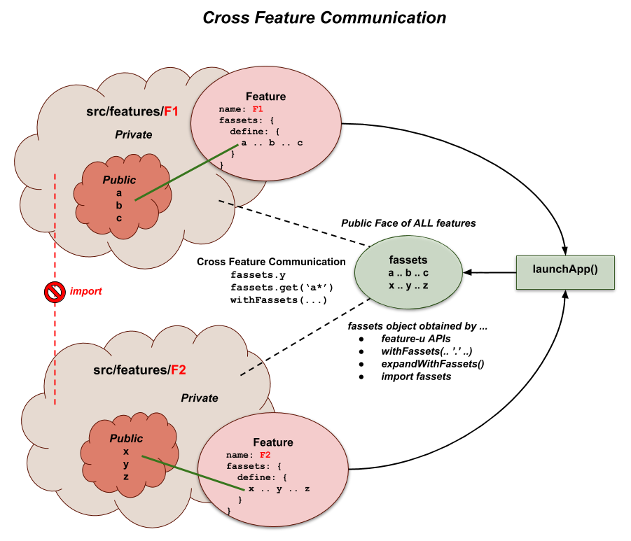

# Cross Feature Communication

A **best practice** of feature-based development _(to the extent
possible)_ is to **treat each feature as an isolated implementation**.
Most aspects of a feature are internal to that feature's
implementation _(for example, actions are typically created and
consumed exclusively by logic/reducers/components that are internal to
that feature)_.

From this perspective, you can think of each feature as it's **own
isolated mini application**.

With that said however, we know that _"**no man is an island**"_!  There
are cases where a feature needs to promote a limited subset of it's
aspects to other features.  For example, a feature may need to:

 - be knowledgeable of some external state (via a selector)
 - emit or monitor actions of other features
 - consolidate component resources from other features - as in **UI Composition**
 - invoke the API of other features
 - etc. etc. etc.

These items form the basis of why **Cross Feature Communication** is
needed.

To complicate matters, as a general rule, **JS imports should NOT
cross feature boundaries**.  The reason being that this
cross-communication should be limited to public access points -
helping to **facilitate true plug-and-play**.

Given all this then, **how is Cross Feature Communication achieved**?

Features need a way to promote their **Public Face** to other
features, and consume other feature's **Public Assets**.


## Basic Concepts: fassets

**feature-u** promotes feature-based resources through something
called `fassets` (feature assets).  This is how all **Cross Feature
Communication** is accomplished.  You can think of this as the **Public
Face** of a feature.

**SideBar**: The term `fassets` is a play on words.  While it is
pronounced "facet" _and is loosely related to this term_, it is spelled
fassets (i.e. feature assets).

The `fassets` terminology is consistently used in both:

- the definition of resources (through the built-in
  {{book.api.fassetsAspect$}})

- and in their usage (through the {{book.api.FassetsObject}} and the
  {{book.api.withFassets}} HoC)




### fassets definition

A feature can expose whatever it deems necessary through the built-in
{{book.api.fassetsAspect$}}).  There is no real constraint on this
resource.  It is truly open.  Typically it is a set of functions or UI
Components, but is not limited to that.  It can be a combination of UI
Components, actions, selectors, API functions, constants, or whatever
your feature needs to promote.

Here is a simple example of how `fassets` are defined:

```js
export default createFeature({

  name:     'featureA',

  fassets: {
    define: {
     'openView':      actions.view.open,      // openView(viewName): Action
     'currentView':   selector.currentView,   // currentView(appState): viewName
     'isDeviceReady': selector.isDeviceReady, // isDeviceReady(appState): boolean
    },
  },

  ...
});
```

As you can see, the {{book.api.fassetsAspect}} has a `define`
directive where resources are cataloged.

In this example, **featureA** is publicly promoting **only three** of
it's many internal aspects ...  one action creator (`openView`) and
two selectors (`currentView`, and `isDeviceReady`).


### fassets usage

To use these public resources, **feature-u** accumulates them from all
active features, and promotes them through the
{{book.api.FassetsObject}} _(emitted from {{book.api.launchApp}})_.

**SideBar**: There are several ways to obtain access the `Fassets object`
_(discussed later - {{book.guide.crossCom_obtainingFassetsObject}})_.

To reference a `fassets` resource, simply dereference it as any other
object reference.  Here is a usage example (using the definition
above):

```js
  fassets.isDeviceReady(appState)
```

**NOTE**: In addition to directly dereferencing a resource on the
`fassets` object, you can also use the {{book.api.Fassets_get}} method
and the {{book.api.withFassets}} HoC _(discussed later)_.  One
advantage of these alternatives is you can utilize wildcards to match
multiple fasset resources.


### federated namespace

fasset keys may contain a federated namespace (using dots -
`.`). When this is done, **feature-u** will normalize them in a
structure with depth.

You can use federated names however you wish, or not at all.  In
general it helps categorize or qualify assets in some way.  You may
want to qualify by feature name, or process type, or any app-specific
structure.

As an example, the following `define` was enhanced _(from above)_ to
include some qualifiers:

```js
export default createFeature({

  name:     'featureA',

  fassets: {
    define: {
     'action.openView':        actions.view.open,      // openView(viewName): Action
     'selector.currentView':   selector.currentView,   // currentView(appState): viewName
     'selector.isDeviceReady': selector.isDeviceReady, // isDeviceReady(appState): boolean
    },
  },

  ...
});
```

and would be referenced as follows:

```js
  fassets.selector.isDeviceReady(appState)
```


## UI Composition

A major benefit of working with React is components.  Components allow
you to split your UI into independent, reusable pieces.

Depending on your feature boundaries, it is very common for a given
component to be an accumulation of sub-components that span several
features.  As a result, **UI Composition is a very important part of
Cross Feature Communication**.

Let's build some concepts by looking at series of examples.

Consider a `common` feature that promotes a series of central
resources, used throughout our application.  The following snippet
demonstrates how a company logo could be promoted to several UI
components.

```js
createFeature({

  name: 'common',

  fassets: {
    define: {
     'company.logo': () => , // a react component
    },
  },
  ... snip snip
});
```

So far nothing new has been introduced in this example.  This is the
same type of resource definition that we have seen previously ... it's
just the resource happens to be a react component.

### withFassets() HoC

{{book.api.withFassets}} is a **feature-u** Higher-order Component
(HoC) that auto-wires fasset properties into a component.  This is a
common pattern popularized by redux `connect()` _(simplifying
component access to application state)_.

Here is how a component would access the `company.logo` _(defined
above)_:

```js
function MyComponent({Logo}) {
  return (
    <div>
      <Logo/>
    </div>
    ... snip snip
  );
}

export default withFassets({
  component: MyComponent,
  mapFassetsToProps: {
    Logo: 'company.logo',
  }
});
```

The {{book.api.withFassets}} HoC auto-wires named feature assets as
component properties through the `mapFassetsToProps` hook.  In this
example, because the `Logo` property is a component, `MyComponent` can
simply reference it using JSX.


## Resource Contract

It is common for UI Composition to be represented as a contract, where
a component in one feature has a series of injection needs that are to
be supplied by other features.

The {{book.api.fassetsAspect}} has additional constructs to facilitate
this contractual arrangement, allowing **feature-u** to provide more
validation in the process.

Rather than just defining resources in one feature and using them in
another:

- A given feature can specify a series of injection needs using the
  `fassets.use` directive.  This identifies a set of **injection keys**
  that uniquely identify these resources.

- Other features will supply this content using the `fassets.defineUse`
  directive, by referencing these same **injection keys**.

This represents more of a **pull** philosophy.  It gives **feature-u**
more knowledge of the process, allowing it to verify that supplied
resources are correct.

**SideBar**: The `define` and `defineUse` directives are very similar,
and in some cases can be used interchangeably.  The `defineUse`
directive does everything `define` does but enforces the additional
constraint that it must match a corresponding `use` request.
Therefore, if your intent is to to supply content that is formally
requested by another feature (via the `use` directive), `defineUse` is
preferred _(even though it can be accomplished by `define`)_,
**because typos can be caught on the definition side**.

Following is a composition example that uses this more formal definition.
In this example our application has a **MainPage**, that promotes a
variety of sub-components: a **ShoppingCart** and a **Search** screen.
Because these sub-components are managed by separate features, we need
a way to pull them into the **MainPage**.

Here is our `main` feature:

- **main feature**

  `src/features/main/index.js`
  ```js
  createFeature({
    name: 'main',
  
    fassets: {
      use: [ // <--- use externally sourced sub-content
         'MainPage.cart.link',
         'MainPage.cart.body',
  
         'MainPage.search.link',
         'MainPage.search.body',
      ],
    },
    ... snip snip
  });
  ```
  
  The `main` feature simply specifies it's need for externally sourced
  sub-content.  This is a contract _(so to speak)_ stating that it plans
  to render this content.
  
  Here is the manifestation of this contract:
  
  `src/features/main/comp/MainPage.js`
  ```js
  function MainPage({Logo, CartLink, SearchLink, CartBody, SearchBody,}) {
    return (
      <div>
        <div> {/* header section */}
          <Logo/>
        </div>
  
        <div> {/* left-nav section */}
          <CartLink/>
          <SearchLink/>
        </div>
  
        <div> {/* body section */}
          <CartBody/>
          <SearchBody/>
        </div>
      </div>
    );
  }
  
  export default withFassets({
    component: MainPage,
    mapFassetsToProps: {
      Logo:       'company.logo', // from our prior example
  
      CartLink:   'MainPage.cart.link',
      CartBody:   'MainPage.cart.body',
  
      SearchLink: 'MainPage.search.link',
      SearchBody: 'MainPage.search.body',
    },
  });
  ```

The following snippets are taken from other features that supply the
definitions for the content to inject:

- **cart feature**

  `src/features/cart/index.js`
  ```js
  createFeature({
    name: 'cart',

    fassets: {
      defineUse: {
       'MainPage.cart.link': () => <Link to="/cart">Cart</Link>,
       'MainPage.cart.body': () => <Route path="/cart" component={ShoppingCart}/>,
      },
    },
    ... snip snip
  });
  ```

- **search feature**

  `src/features/search/index.js`
  ```js
  createFeature({
    name: 'search',

    fassets: {
      defineUse: {
       'MainPage.search.link': () => <Link to="/search">Search</Link>,
       'MainPage.search.body': () => <Route path="/search" component={Search}/>,
      },
    },
    ... snip snip
  });
  ```

Two external features (**cart** and **search**) define the content
that is requested by the **main** feature.

The `fassets.defineUse` directive requires that the resource keys match a
`fassets.use` feature request.  This is the contract that provides
**feature-u** insight when enforcing it's validation.

**SideBar**: Because we are also dealing with navigation, we introduce
{{book.ext.reactRouter}} into the mix (with the `Link` and `Route`
components).  Because of RR's V4 design, our routes are also handled
through component composition.


## Wildcards (adding dynamics)

In our prior example we explicitly define each injection key, and
strategically place it in our parent component.  While this may be
necessary in some cases, typically more dynamics are required
_(allowing features to introduce their content autonomously)_.

This can be accomplished by using wildcards (`*`).

Here is our **refined** `main` feature _(**NOTE**: the definitions
from the defining features are the same, so they are not repeated)_:

- **main feature**

  `src/features/main/index.js`
  ```js
  createFeature({
    name: 'main',

    fassets: {
      use: [
         'MainPage.*.link',
         'MainPage.*.body',
      ],
    },
    ... snip snip
  });
  ```

  Because our specification includes wildcards, a series of
  definitions will match!

  Here is our **refined** `MainPage` component:

  `src/features/main/comp/MainPage.js`
  ```js
  function MainPage({Logo, mainLinks, mainBodies}) {
    return (
      <div>
        <div> {/* header section */}
          <Logo/>
        </div>

        <div> {/* left-nav section */}
          {mainLinks.map( (MainLink, indx) => <MainLink key={indx}/>)}
        </div>

        <div> {/* body section */}
          {mainBodies.map( (MainBody, indx) => <MainBody key={indx}/>)}
        </div>
      </div>
    );
  }

  export default withFassets({
    component: MainPage,
    mapFassetsToProps: {
      Logo:       'company.logo',    // from our prior example

      mainLinks:  'MainPage.*.link', // find matching
      mainBodies: 'MainPage.*.body',
    },
  });
  ```

When {{book.api.withFassets}} encounters wildcards (`*`), it merely
accumulates all matching definitions, and promotes them as arrays.
Our **MainPage** component no longer explicitly reasons about each
injection.

Through this implementation, **any feature may dynamically inject
itself in the process autonomously**!  In addition, this dynamic
implicitly handles the case where a feature is dynamically disabled
_**(very kool indeed)**_!!


### Wildcard Processing

This section provides additional detail related to wildcard
processing.  For the examples **below**, please assume the following
resource definitions:

```
fassetsKey             Resource
=====================  ========
'company.logo'            1
'MainPage.cart.link'      2
'MainPage.cart.body'      3
'MainPage.search.link'    4
'MainPage.search.body'    5
'my.fun.object'           6 ... { greet: 'hello' }
```

**Wildcard Characters:**

Currently, only one wildcard character is supported:

- `*`: Matches zero or more characters.  Can also span multiple nodes
  _(i.e. the dots `.` of a federated namespace)_.

  **Examples:**
  ```
  fassetsKey             Matches
  =====================  =============
  'company.logo'         1
  '*link'                [  2,  4    ]
  'MainPage.*.link'      [  2,  4    ]
  'MainPage.*.body'      [    3,  5  ]
  'MainPage.*'           [  2,3,4,5  ]
  '*a*'                  [1,2,3,4,5  ]
  '*'                    [1,2,3,4,5,6]
  'ouch'                 undefined
  'WowZee*WooWoo'        []
  ```

**Wildcard Matching:**

The following pattern matching rules are in effect:

- Pattern matching is case-sensitive.  _It is worth noting that
  `fassetsKey` definitions are also case-sensitive._

  **Examples:**
  ```
  fassetsKey             Matches
  =====================  ===========
  'MainPage.*.link'      [2,4]
  'mainPage.*.link'      []
  ```

- By default, the entire entry is matched. In other words an
  implicit start/end anchor is applied.  This heuristic can be
  altered by simply injecting wildcards at the start/end of your
  expression.

  **Examples:**
  ```
  fassetsKey             Matches
  =====================  ===========
  'Page.*.link'          []
  '*Page.*.link'         [2,4]
  ```

- Matches are restricted to the actual fassetKeys registered through
  the {{book.api.fassetsAspect}} `define`/`defineUse` directives.  In
  other words, the matching algorithm will **not** drill into the
  resource itself (assuming it is an object with depth).

  **Examples:**
  ```
  fassetsKey             Matches
  =====================  ==========================
  'my.*.object'          [6] ... { greet: 'hello' }
  'my.*.object.greet'    []
  ```


### Resource Order (in wildcard processing)

The order in which resources are promoted _when wildcards are in use_,
is feature expansion order.  In other words, the **same order that
features are registered**.

### React Keys (in array processing)

As you probably already know, React requires a `key` attribute when
injecting elements of an array.

You may have noticed _(in the wildcard example - above)_, we are using
array indices for our keys.  In some cases this may be considered an
anti-pattern, _leading to inefficiencies in DOM reconciliation._ **It
really depends on the mutability status of the array.** Remember, the
key must only be unique among its siblings - not globally _(please
refer to the React docs
[`here`](https://reactjs.org/docs/reconciliation.html#keys))_.

In the case of fasset usage, key indices **will in fact work in most
cases** - assuming there is no variability in the promoted set of
fasset resources _(a normal case)_.

If however there is some conditional logic involved, you may request
{{book.api.withFassets}} to supply a `[fassetsKey, resource]` pair, by
using the `@withKeys` suffix.  This is an ideal solution because
**feature-u** guarantees `fassetsKey` to be unique.

```js
// mapping snippet ...
   mainLinks:  'MainPage.*.link@withKeys', // @withKeys: request [fassetsKey, resource] pairs
                // mainLinks:  [['MainPage.cart.link',   cartLinkResource],
                //              ['MainPage.search.link', searchLinkResource]],

// array injection snippet ...
   {mainLinks.map( ([fassetsKey, MainLink]) => <MainLink key={fassetsKey}/>)}
```


## Resource Validation

Resource validations can optionally be specified through the
{{book.api.fassetsAspect}} `use` directive.  This includes:

- optionality _(required/optional)_ 
- and data type/content

By default, the `use` directive simply accepts an array of strings
_(the resources keys which will be used)_.  This represents resources
that are **required** of type **any**.  You can change this default by
replacing each string with a two element array containing the resource
key followed by an options object:

```js
[ '$fassetsKey', {           // resource key with options object
  required:   true/false,    // DEFAULT: true
  type:       $validationFn, // DEFAULT: any
}]
```

- Required items disallow the `undefined` value.

- Type/content validation is specified through a function reference.
  You may define your own validations, or use one of the canned
  validators provided by **feature-u**.  Please refer to
  {{book.api.fassetValidations}} for a list of the pre-defined
  validators, as well as the validation API.

Here is an example that employs validations.  Notice the mix of both
strings _(with their default semantics)_, and the options object
_(specifying the validation constraints)_:

```js
createFeature({
  fassets: {
    use: [
       'MainPage.*.link', // DEFAULT: required of type any
      ['MainPage.*.body', {required: false, type: fassetValidations.comp}],
    ],
  },
});
```


## Does Feature Exist

The {{book.api.FassetsObject}} can be used to determine if a feature
is present or not.  If a feature does not exist, or has been disabled,
the {{book.api.Fassets_hasFeature}} will return false.

 - It could be that `featureA` will conditionally use `featureB` if it
   is present.

   ```js
   if (fassets.hasFeature('featureB') {
     ... do something featureB related
   }
   ```

 - It could be that `featureC` unconditionally requires that `featureD`
   is present.  This can be checked in the {{book.api.appWillStartCB}}
   {{book.guide.appLifeCycle}}.

   ```js
   appWillStart({fassets, curRootAppElm}) {
     assert(fassets.hasFeature('featureD'), '***ERROR*** I NEED featureD');
   }
   ```

**NOTE**: In addition to `fassets.hasFeature(featureName)` it is also
possible to reason over the existence of well-known fasset resources
that are specific to a feature.

## Push or Pull: a fassets summary

At this point, it may be useful to summarize the three
{{book.api.fassetsAspect}} directives: `define`, `use`, and
`defineUse` ... _highlighting two broad use cases_.

As it turns out, when it comes to the definition and consumption of
fasset resources _(covered in the prior sections)_, there are two
broad philosophies: **push** or **pull**.

- **Push** - _"throw it over the wall"_ 

  - **Definition:**
    
    When defining resources in a **push** philosophy the `define`
    directive is crucial.  Here the supplier is simply publicly promoting
    a resource for other features to use **(take it or leave it)**.  The
    supplier is merely saying: _"this is my Public Face"_.
    
  - **Consumption:**
    
    Normally, in a **push** philosophy, the consumer simply accesses
    the resource **without any `use` directive** _(through
    {{book.api.FassetsObject}} or {{book.api.withFassets}} HoC)_.
    
    _Optionally_ however, the consumer may employ the `use` directive.
    Here they are simply providing **feature-u** with more information,
    so the system will fail fast _(at startup time)_ when the resource
    is not defined.  In other words, there would never be a need for the
    consumer to check if the resource is defined _(assuming the `use`
    contract is "required")_.  Rather, that constraint is achieved by
    **feature-u**.  **Note**: _This scenario highlights that multiple
    features can specify the same `use` directive, providing their
    {{book.guide.crossCom_resourceValidation}} does not conflict_.
    
- **Pull** ... _"a resource contract"_ 
    
  - **Consumption:**
    
    When using a **pull** philosophy, the `use` directive is more
    critical.  In this case the consumer is saying: _"I plan to use this
    resource from whatever feature(s) wish to supply it"_.  This is the
    first half of a {{book.guide.crossCom_resourceContract}}!

    Typically a `use` contract is made with wildcards, although not
    required.  Wildcards allow external features to inject their
    content autonomously.

    **SideBar**: It is important that the consumer fulfill this
    contract by programmatically accessing the resource defined in it's
    `use` contract _(through {{book.api.FassetsObject}} or
    {{book.api.withFassets}} HoC)_.  This is outside the control of
    **feature-u**.

  - **Definition:**
    
    When defining a resource in the **pull** philosophy, the supplier
    should use the `defineUse` directive _(even though a `define`
    would technically work)_.  Here the supplier is saying _"I am
    supplying this resource under contract"_.  In this case the system
    will fail fast _(at startup time)_ if there is NO fulfillment of
    this contract _(for example a typo)_.


## Obtaining fassets object

Broadly speaking, Public Facing fasset resources can be obtained
either by:

- using the {{book.api.withFassets}} HoC (for UI Components),

- or by directly referencing the {{book.api.FassetsObject}}
  programmatically.

The former, implicitly accesses `fassets` _(under the covers)_ using a
{{book.ext.reactContext}}.  The latter requires direct programmatic
access to the {{book.api.FassetsObject}} ... of which there are four
ways to achieve:

1. Use the {{book.guide.crossCom_fassetsParameter}} supplied through
   **feature-u**'s programmatic APIs ... for code that is under the
   control of **feature-u** _(for example, life-cycle hooks, or logic
   hooks, etc.)_.

2. {{book.guide.crossCom_injectFassetsCompProps}} ... for react
   components _(using the special {{book.api.withFassets}} `'.'`
   keyword, injecting the `fassets` object itself)_.

3. {{book.guide.crossCom_importFassets}} from your application
   mainline ... for code that is outside the control of **feature-u**
   _(providing the reference is **not** needed during inline
   code-expansion)_.

4. Use {{book.guide.crossCom_managedCodeExpansion}} ... for
   {{book.api.AspectContent}} definitions requiring `fassets` during
   inline code-expansion _(employing the
   {{book.api.expandWithFassets}} wrapper function)_.

You may be asking yourself: **"Why so many techniques"**?  _Let's
delve into this just a bit ..._

Generally speaking, programmatic access to the
{{book.api.FassetsObject}} is complicated by whether it is needed
during inline code-expansion or not.

- The fact that {{book.api.launchApp}} accumulates fasset resources,
  means that it must run to completion before `fassets` is made
  available through an import.

- Furthermore, the goal of restricting cross-feature imports requires
  that the `fassets` object be used in place of imports.

In spite of these seemingly conflicting artifacts, **the goal of
restricting cross-feature imports is most certainly a worthy
objective!** The bottom line is that
{{book.guide.crossCom_managedCodeExpansion}} comes to the rescue, and
"fills the gap" when needed.

Accessing external feature resources in a seamless way is a
**rudimentary benefit of feature-u** that alleviates a number of
problems in your code, **making your features truly plug-and-play**.

**SideBar**: It is possible that a module may be using more than one of
these access techniques.  As an example a logic module may have to use
{{book.api.expandWithFassets}} to access `fassets` at code-expansion
time, but is also supplied `fassets` as a parameter in it's functional
hook.  This is perfectly fine, as they will be referencing the exact
same `fassets` object instance.

_**Let's take a closer look at each of these access points.**_


<!-- 11111111111111111111111111111111111111111111111111111 -->
### fassets parameter

The simplest way to access the {{book.api.FassetsObject}} is through
the programmatic APIs of **feature-u**, where `fassets` is supplied as
a parameter.  This covers any process that is under the control of
**feature-u**, for example:

- app life-cycle hooks:
  
  - {{book.api.appWillStartCB$}}
  - {{book.api.appDidStartCB$}}


- route hooks (PKG: {{book.ext.featureRouter}}):
  ```js
  routeCB({fassets, appState}): rendered-component (null for none)
  ```
  
- logic hooks (PKG: {{book.ext.reduxLogic}}):
  ```js
  createLogic({
    ...
    transform({getState, action, fassets}, next) {
      ...
    },
    process({getState, action, fassets}, dispatch, done) {
      ...
    }
  })
  ```


<!-- 22222222222222222222222222222222222222222222222222222 -->
### Inject fassets comp props

For react components, you can inject the {{book.api.FassetsObject}}
directly in your component properties by using the special
{{book.api.withFassets}} `'.'` keyword.  This emits the `fassets`
object itself _(in the same tradition as "current directory")_.

When using the {{book.api.withFassets}} HoC you have a choice ... you
can inject selected assets as needed, or the the entire `fassets`
object, or both ... _it's really a personal preference_.

As it turns out, this can even be used to introduce `fassets` into
other HoCs, such as redux `connect()` using it's `ownProps` parameter.

Here is an example:

```js
const MyComp = ({fassets, Logo, eggCount}) => {
  return (
    <div>
      <Logo/>
      <p>My egg total: {eggCount}</p>
    </div>
    ... can use fassets here too (if desired)
  );
};

const MyConnectedComp = connect( // standard redux connect
 (state, {fassets}) => ({ // ... fassets available in ownProps (via withFassets() below)
   eggCount: fassets.selectors.getEggCount(state), // ... uses external feature selector (via fassets)
 }),
)(MyComp);

export default withFassets({
  mapFassetsToProps: {
    fassets: '.', // ... introduce fassets into component props via the '.' keyword
    Logo:    'company.logo',
  }
})(MyConnectedComp);
```

<!-- 33333333333333333333333333333333333333333333333333333 -->
### import fassets

For run-time functions that are outside the control of **feature-u**,
simply import `fassets` from your application mainline.

Your mainline exports the {{book.api.launchApp}} return value
... which is the {{book.api.FassetsObject}}.

**`src/app.js`**
```js
// launch our app, exposing the feature-u Fassets object (facilitating cross-feature communication)!
export default launchApp({
  ...
});
```

While imports are a simple and straight forward process, they cannot be
used when the reference is needed during inline code-expansion
_(because {{book.api.launchApp}} must run to completion)_.

<!-- 
  TODO: The above point may highlight an uncovered condition:
        - If we are in a module OUTSIDE of the control of feature-u
        - and we need fassets during inline code-expansion
        Is this a condition where "we can't get there from here"?
        HOWEVER, this may be a sign of a code smell (not really sure)
-->


As it turns out, importing `fassets` is not usually necessary, because
most cases are covered through the alternate means.

For sake of example, let's consider a somewhat contrived example,
where a piece of code needs to close the leftNav menu.  This function
is provided by a Public Facing resource defined in the leftNav
feature.

```js
import fassets from '../app';

function closeSideBar() {
  fassets.leftNav.close();
}
```


<!-- 44444444444444444444444444444444444444444444444444444 -->
### Managed Code Expansion

The last technique to access the {{book.api.FassetsObject}},
provides **early access** _during code expansion time_, through the
{{book.api.expandWithFassets}} utility.

There are two situations that make accessing `fassets` problematic,
which are: **a:** _in-line code expansion (where `fassets` may not
be fully defined)_, and **b:** _order dependencies (across
features)_.

To illustrate this, the following {{book.ext.reduxLogic}} module is
monitoring an action defined by an external feature (see `*1*`).
Because this `fassets` reference is made during code expansion time, the
import will not work, because the `fassets` object has not yet been fully
defined.  This is a timing issue.

```js
import fassets from '~/app'; // *1*

export const myLogicModule = createLogic({

  name: 'myLogicModule',
  type: String(fassets.featureB.actions.fooBar), // *1* fassets NOT defined during in-line expansion
  
  process({getState, action}, dispatch, done) {
    ... 
  },

});
```

When {{book.api.AspectContent}} definitions require the
{{book.api.FassetsObject}} at code expansion time, you can wrap the
definition in a {{book.api.expandWithFassets}} function.  In other
words, your aspect content can either be the actual content itself
_(ex: a reducer)_, or a function that returns the content.

Your callback function should conform to the following signature:

**API**: {{book.api.expandWithFassetsCB$}}

When this is done, **feature-u** will invoke the
{{book.api.expandWithFassetsCB}} in a controlled way, passing the fully
resolved {{book.api.FassetsObject}} as a parameter.

To accomplish this, you must wrap your expansion function with the the
{{book.api.expandWithFassets}} utility.  The reason for this is that
**feature-u** must be able to distinguish a
{{book.api.expandWithFassetsCB}} function from other functions (ex:
reducers).

Here is the same example (from above) that that fixes our
problem by replacing the `fassets` import with {{book.api.expandWithFassets}}:

```js
                             // *1* we replace fassets import with expandWithFassets()
export const myLogicModule = expandWithFassets( (fassets) => createLogic({

  name: 'myLogicModule',
  type: String(fassets.featureB.actions.fooBar), // *1* fassets now is fully defined
  
  process({getState, action}, dispatch, done) {
    ... 
  },

}) );
```

Because {{book.api.expandWithFassetsCB}} is invoked in a controlled way
(by **feature-u**), the supplied `fassets` parameter is guaranteed to be
defined (_issue **a**_).  Not only that, but the supplied `fassets` object
is guaranteed to have all public facing feature definitions resolved
(_issue **b**_).

**_SideBar_**: A secondary reason {{book.api.expandWithFassets}} may be
used (_over and above `fassets` injection during code expansion_) is to
**delay code expansion**, which can avoid issues related to
(_legitimate but somewhat obscure_) circular dependencies.
