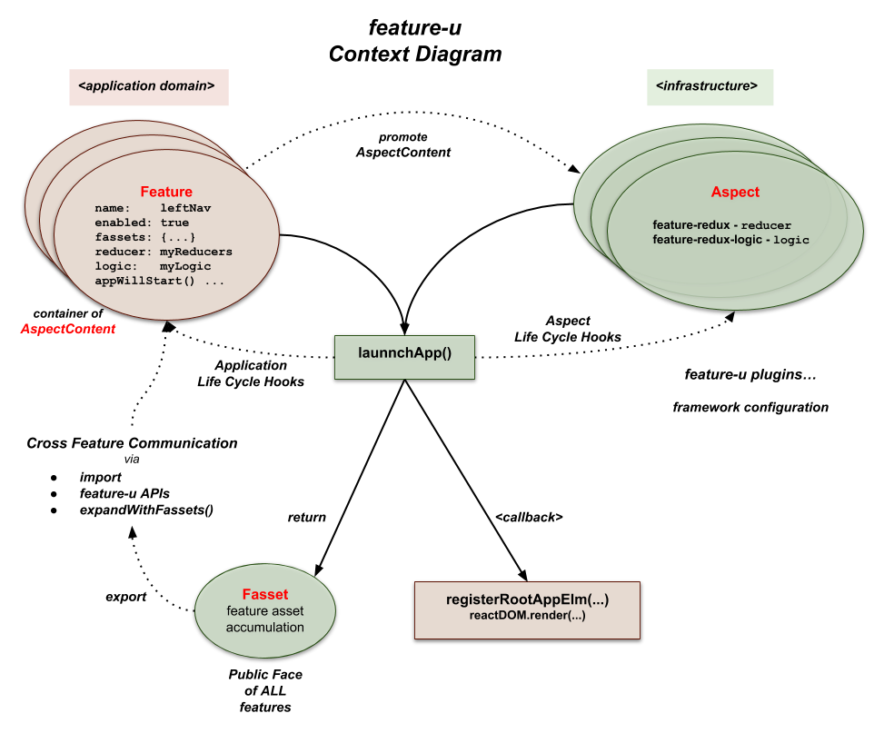

# A Closer Look

As previously mentioned, the basic process of **feature-u** is that
each feature promotes a {{book.api.Feature}} object that calalogs
various aspects of that feature ... _things like: the feature's name,
it's Public Face, whether it is enabled, initialization constructs, and
resources used to configure it's slice of the frameworks in use._

In turn, these Feature objects are supplied to {{book.api.launchApp}},
which configures and starts your application, returning an
{{book.api.FassetsObject}} (_which promotes the Public Face of each
feature_).

<!-- OK ... enough talk ... bring out the diagram ... nix 1000 words ... drop the mic! -->

_Let's take a closer look at this process ..._



<!--  -->


<!-- *** SECTION ********************************************************************************  -->
## aspects

In **feature-u**, "aspect" is a generalized term used to refer to the various
ingredients that (when combined) constitute your application.  Aspects
can take on many different forms ... for example:

  - UI Components and Routes, 
  - State Management (actions, reducers, selectors), 
  - Business Logic, 
  - Startup Initialization Code, 
  - etc.

**Not all aspects are of interest to feature-u** ...  _only those that
are needed to setup and launch the app_ ... all others are
considered to be an internal implementation detail of the feature.  As
an example, consider the redux state manager: while it uses actions,
reducers, and selectors ... only reducers are needed to setup and
configure redux.

**feature-u** provides a base set of **built-in aspects** (out-of-the-box)
but allows additional aspects to be introduced through it's extendable
API.

1. [**Built-In aspects**](#built-in-aspects):

   These aspects are promoted directly by the base **feature-u** package.
   They provide very rudimentary capabilities, such as feature
   enablement, Public Face, and application life-cycle hooks.

1. [**Extendable aspects**](#extendable-aspects):

   These aspects are promoted by external packages (_or self defined
   in your project_).  They provide **feature-u** integration with other
   frameworks (for example {{book.ext.redux}} state management, or
   {{book.ext.reduxLogic}} business logic, or navigational routers,
   etc.).  They are created with **feature-u**'s extendable API, and are
   packaged separately, so as to not introduce unwanted dependencies.


<!-- *** SECTION ********************************************************************************  -->
## Feature Object (relaying aspect content)

The {{book.api.Feature}} object is merely a lightweight container that
holds {{book.api.AspectContent}} of interest to **feature-u**.

Each feature within an application promotes a Feature object (using
{{book.api.createFeature}}) which catalogs the aspects of that feature.

Ultimately, all Feature objects are consumed by {{book.api.launchApp}}. 

Feature content are simple key/value pairs (the key being an
Aspect.name with values of AspectContent).  These aspects can
either be **built-in** (from core **feature-u**), or **extensions**.

Here is an example:

```js
export default createFeature({
  name:     'featureA', // builtin aspect (name must be unique across all features within app)
  enabled:  true,       // builtin aspect enabling/disabling feature

  fassets: {            // builtin aspect promoting Public Face - Cross Feature Communication
    define: {
      'api.openA':  () => ...,
      'api.closeA': () => ...,
    },
  },

  appWillStart: (...) => ..., // builtin aspect (Application Life Cycle Hook)
  appDidStart:  (...) => ..., // ditto

  reducer: ..., // feature redux reducer (extended aspect from the feature-redux plugin)
  logic:   ..., // feature logic modules (extended aspect from the feature-redux-logic plugin)
});
```


### Built-In aspects

Built-in aspects are promoted directly by the base **feature-u** package.
They provide very rudimentary capabilities, such as feature
enablement, Public Face, and application life-cycle hooks.

Like all aspects, Built-In aspect content is relayed through Feature
object properties (via {{book.api.createFeature}}).

- `Feature.name`

  A string property which represents the identity of the feature.
  Feature names are guaranteed to be unique.  Application code can
  also use {{book.guide.bestPractices_featureName}} in various
  **single-source-of-truth** operations.


- `Feature.enabled`

  A boolean property that determines whether the feature is enabled or
  not.  This indicator is typically based on a dynamic expression,
  allowing packaged code to be dynamically enabled/disabled at
  run-time _(please refer to: {{book.guide.enablement}})_.


- {{book.api.fassetsAspect$}}

  An optional aspect that promotes feature assets used in
  {{book.guide.crossCom}} (i.e. the Public Face of a feature).
  `fassets` directives can both define resources, and/or declare a
  resource contract (the intention to use a set of fasset resources).
  Resources are accumulated across all features, and exposed through
  the {{book.api.FassetsObject}}, and the {{book.api.withFassets}}
  HoC. For more information, please see {{book.api.fassetsAspect$}}.


- {{book.guide.appWillStartCB}}

  An optional {{book.guide.appLifeCycle}} invoked one time, just
  before the app starts up.  This life-cycle hook can do any type of
  initialization, and/or optionally supplement the app's top-level
  content (using a non-null return) _(please refer to:
  {{book.api.appWillStartCB}})_.


- {{book.guide.appDidStartCB}}
  
  An optional {{book.guide.appLifeCycle}} invoked one time, immediately
  after the app has started.  Because the app is up-and-running at
  this time, you have access to the appState and the dispatch()
  function ... assuming you are using redux (when detected by
  **feature-u**'s plugable aspects) _(please refer to:
  {{book.api.appDidStartCB}})_.


### Extendable aspects

**feature-u** is extendable!  Extendable Aspects provide **feature-u**
integration with other frameworks (for example {{book.ext.redux}}
state management, or {{book.ext.reduxLogic}} business logic, etc.).
For this reason (_by in large_) **they provide the most value**,
because they **fully integrate your features into your run-time
stack!**

Extendable Aspects are packaged separately from **feature-u**, so as to not
introduce unwanted dependencies (_because not everyone uses the same
frameworks_).  You pick and choose them based on the framework(s) used
in your project (_matching your project's run-time stack_).

Extendable Aspects are created with **feature-u**'s
{{book.guide.extensionApi}}, using {{book.api.createAspect}}.  You can
define your own Aspect (_if the one you need doesn't already exist_)!
For more information, please see {{book.guide.extending}}.

Like all aspects, Extendable Aspect content is relayed through Feature
object properties (via {{book.api.createFeature}}).

Because Extendable Aspects are not part of the base **feature-u**
package, it is a bit problematic to discuss them here (_they are
either in a separate npm package, or self contained in your project_).
**You should search the npm registry with the `'feature-u'` keyword**
_to find the ones that meet your requirements_.  With that said, we
will briefly discuss the Extendable Aspects that were created in
conjunction with the initial development of **feature-u** (_just to give
you a feel of what is possible_).


- `Feature.reducer` via: **{{book.ext.featureRedux}}**
  
  **{{book.ext.featureRedux}}** is the **feature-u** integration point
  to {{book.ext.redux}}!

  It configures {{book.ext.redux}} through the `reducerAspect` (_to be
  supplied to_ {{book.api.launchApp}}), which extends the Feature object,
  adding support for the `Feature.reducer` property, referencing
  feature-based reducers.

  Only reducers are of interest because that is all that is needed to
  configure [redux].  All other redux items (_actions, selectors,
  etc._) are considered to be an internal implementation detail of the
  feature.

  The `Feature.reducer` content must be embellished by
  `slicedReducer()`, which provides instructions on how to combine
  multiple feature-based reducers in constructing the overall
  top-level application state tree.

  Because **feature-redux** manages redux, it also provides an
  integration hook to other Aspects that need to inject redux
  middleware.

  Please refer to the **{{book.ext.featureRedux}}** documentation for
  complete details.

 
- `Feature.logic` via: **{{book.ext.featureReduxLogic}}**

  **{{book.ext.featureReduxLogic}}** is the **feature-u** integration
  point to {{book.ext.reduxLogic}}!

  It configures {{book.ext.reduxLogic}} through the `logicAspect` (_to be
  supplied to_ {{book.api.launchApp}}), which extends the Feature object,
  adding support for the `Feature.logic` property, referencing
  feature-based logic modules.

  The following article is an introduction (and motivation) for the
  development of redux-logic: [Where do I put my business logic in a
  React-Redux
  application](https://medium.com/@jeffbski/where-do-i-put-my-business-logic-in-a-react-redux-application-9253ef91ce1).

  Please refer to the **{{book.ext.featureReduxLogic}}** documentation
  for complete details.

 
- `Feature.route` via: **{{book.ext.featureRouter}}**

  **{{book.ext.featureRouter}}** is the **feature-u** integration point to
  **Feature Routes**!

  It configures **Feature Router** through the `routeAspect` (_to be
  supplied to_ {{book.api.launchApp}}), which extends the Feature object,
  adding support for the `Feature.route` property, referencing routes
  defined through the `featureRoute()` function.

  **Feature Routes** are _based on a very simple concept_: **allow the
  application state to drive the routes!** It operates through a
  series of registered functional callback hooks, which determine the
  active screen based on an analysis of the the overall appState.
  This is particularly useful in feature-based routing, because each
  feature can promote their own UI components in an encapsulated and
  autonomous way!  Because of this, **feature-router** is a
  preferred routing solution for **feature-u**.

  **Feature Routes** is the recommended solution for feature-based
  navigation.  You can find more information in the
  {{book.guide.featureRouter}} section.

  Please refer to the **{{book.ext.featureRouter}}** documentation for
  complete details.


<!-- *** SECTION ********************************************************************************  -->
## Launching Your Application

By interpreting the set of Aspects and Features that comprise an
application, **feature-u** can actually coordinate the launch of your
application (i.e. **start it running**)!

This is accomplished through the {{book.api.launchApp}} function.

- It manages the setup and configuration of the frameworks in use,
  such as {{book.ext.redux}}, {{book.ext.reduxLogic}}, etc.  This is
  based on a set of supplied plugable Aspects that extend
  **feature-u**, integrating external frameworks to match your
  specific run-time stack.

- It facilitates application life-cycle hooks on the {{book.api.Feature}} object,
  allowing features to manage things like: initialization and
  injecting root UI elements, etc.

- It creates and promotes the {{book.api.FassetsObject}} which contains the Public Face
  of all features, facilitating a cross-communication between features.

As a result, your application mainline is very simple and generic.
There is no real app-specific code in it ... **not even any global
initialization**!  That is because **each feature can inject their own
app-specific constructs**!!  The mainline merely accumulates the
Aspects and Features, and starts the app by invoking {{book.api.launchApp}}:


**src/app.js**
```js
import React                 from 'react';
import ReactDOM              from 'react-dom';
import {launchApp}           from 'feature-u';
import {createRouteAspect}   from 'feature-router';      // *1*
import {createReducerAspect} from 'feature-redux';       // *1*
import {createLogicAspect}   from 'feature-redux-logic'; // *1*
import SplashScreen          from './util/comp/SplashScreen';
import features              from './features';          // *2*

const routeAspect   = createRouteAspect();   // *1*
const reducerAspect = createReducerAspect(); // *1*
const logicAspect   = createLogicAspect();   // *1*

// define our set of "plugable" feature-u Aspects, conforming to our app's run-time stack
const aspects = [ // *1*
  routeAspect,    // Feature Routes ... order: early - it's DOM injection does NOT support children
  reducerAspect,  // redux          ... order: later - <Provider> DOM injection should be on top
  logicAspect,    // redux-logic    ... order: N/A   - NO DOM injection
];


// configure our Aspects (as needed)
// ... Feature Route fallback screen (when no routes are in effect)
routeAspect.config.fallbackElm$ = <SplashScreen msg="I'm trying to think but it hurts!"/>;


// launch our app, exposing the feature-u Fassets object (facilitating cross-feature communication)!
export default launchApp({         // *4*
  aspects,                         // *1*
  features,                        // *2*
  registerRootAppElm(rootAppElm) { // *3*
    ReactDOM.render(rootAppElm,
                    getElementById('myAppRoot'));
  }
});
```

The Aspect collection _(see `*1*` in the code snippet above)_ reflects
the frameworks of our run-time stack _(in our example
{{book.ext.redux}}, {{book.ext.reduxLogic}}, and
{{book.ext.featureRouter}} )_ and extend the acceptable Feature
properties _(`Feature.reducer`, `Feature.logic`, and `Feature.route`
respectively)_ ... _**see:** {{book.guide.detail_extendableAspects}}_.
In this case, all our Aspects were pulled from external npm packages,
however you can define your own using {{book.api.createAspect}}.

All of our supplied app features are accumulated from the `features/`
directory ... _(see `*2*` in the code snippet above)_.

## Export fassets

The {{book.api.FassetsObject}} _(emitted from {{book.api.launchApp}})_
promotes the accumulated Public Face of all features.  This is the
basis of {{book.guide.crossCom}}.

By **feature-u** decree, this object should be exported _(see `*4*`
in the code snippet above)_, providing import access to other modules.
**SideBar**: In reality there are several ways to access the
`fassets` object _(depending on the context)_, import is just one
_(see: {{book.guide.crossCom_obtainingFassetsObject}})_.

You can find more information about the {{book.api.FassetsObject}} in
{{book.guide.crossCom}}.


### React Registration

The {{book.api.launchApp}} function uses a
{{book.api.registerRootAppElmCB}} callback _(see `*3*` in the code
snippet above)_ to catalog the supplied `rootAppElm` to the specific
React platform in use.

**API:** {{book.api.registerRootAppElmCB$}}

**NOTE** regarding the `rootAppElm`:

- Typically the supplied `rootAppElm` will have definition, based on the
  Aspects and Features that are in use.  In this case, it is the
  responsibility of this callback to register this content in some way
  (either directly or indirectly).

- However, there are atypical isolated cases where the supplied
  `rootAppElm` can be null.  This can happen when the app chooses NOT to
  use Aspects/Features that inject any UI content.  In this case, the
  callback is free to register it's own content.

Because this registration is accomplished by your app-specific code,
**feature-u** can operate in any of the React platforms, such as:

**React Web**
```js
import ReactDOM from 'react-dom';
...
export default launchApp({
  aspects,
  features,
  registerRootAppElm(rootAppElm) { // *3*
    ReactDOM.render(rootAppElm,
                    getElementById('myAppRoot'));
  }
});
```

**React Native**
```js
import {AppRegistry} from 'react-native';
...
export default launchApp({
  aspects,
  features,
  registerRootAppElm(rootAppElm) { // *3*
    AppRegistry.registerComponent('myAppKey',
                                  ()=>rootAppElm); // convert rootAppElm to a React Component
  }
});
```

**Expo**
```js
import Expo from 'expo';
...
export default launchApp({
  aspects,
  features,
  registerRootAppElm(rootAppElm) { // *3*
    Expo.registerRootComponent(()=>rootAppElm); // convert rootAppElm to a React Component
  }
});
```
